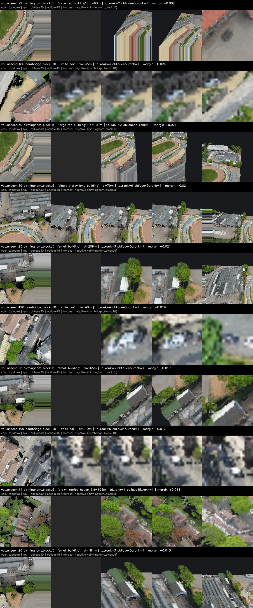
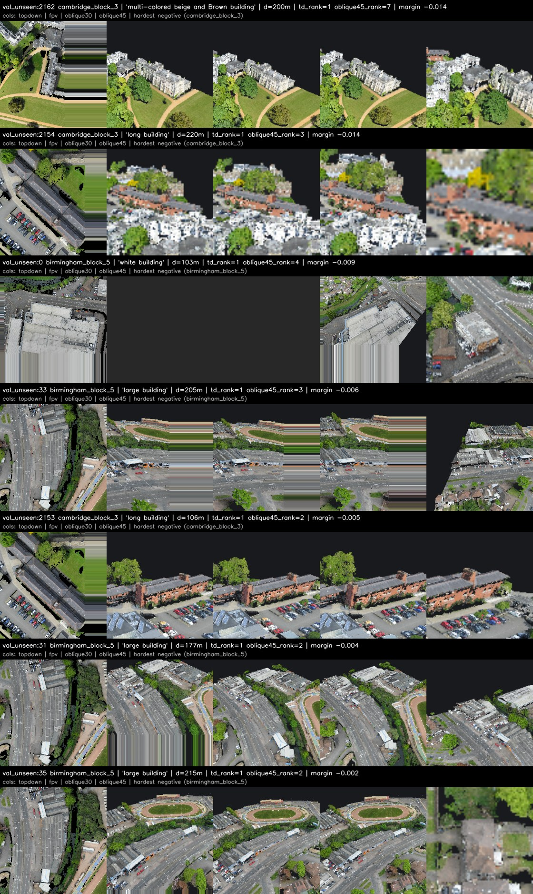
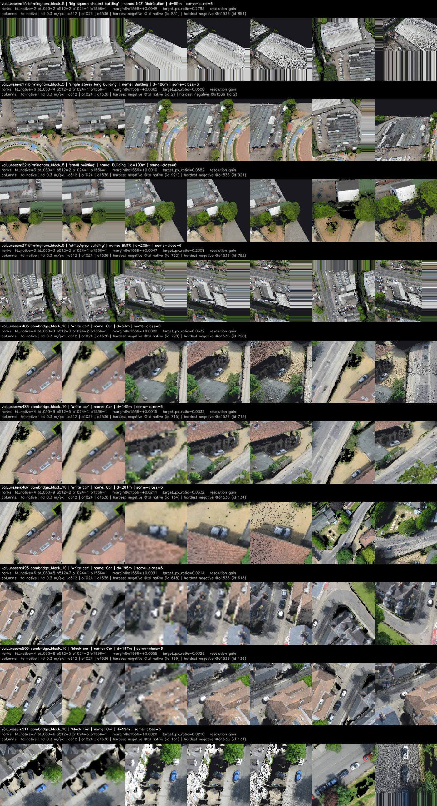
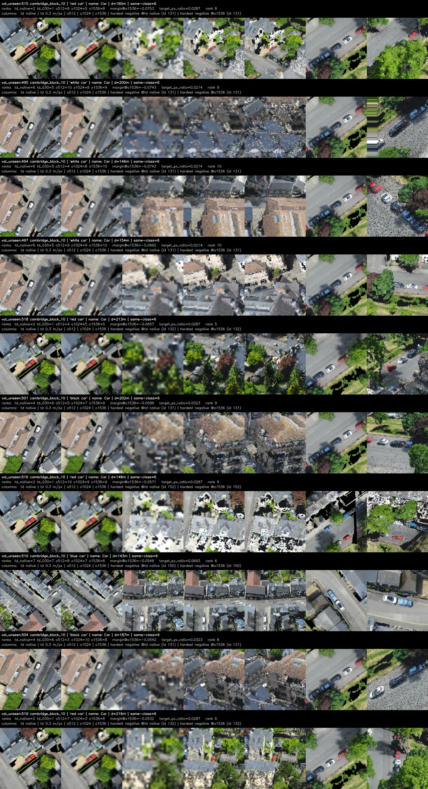
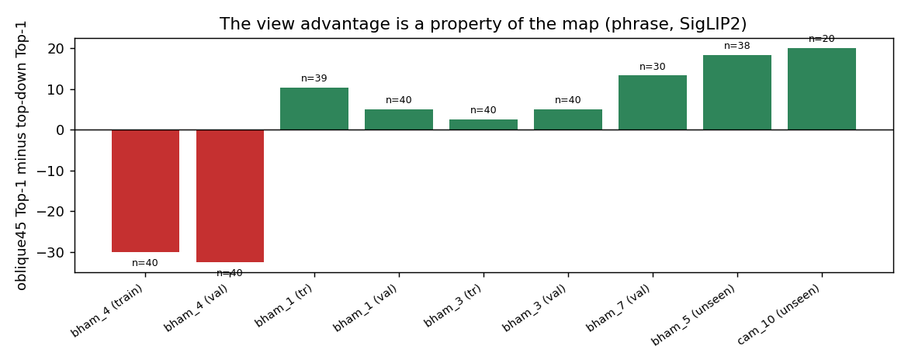

# SensatUrban FPV rendering — pose alignment, render usability, and whether the view helps

**Branch** `2027-CVPR/sensaturban-fpv-rendering`
**Base commit** `14b07d3` (hett-crotonyl, `codex/landmark-arrival-understanding`)
**Worktree** `Achieved/hett-experiments/55-sensaturban-fpv-rendering`
**Date** 2026-10-06

No navigation model was trained, no controller, policy or trajectory was
modified, and nothing was wired into the HETT trunk.

---

## 0. Headline

**Gate A: PASS. Gate B: WEAK PASS.**

1. **CityNav poses are already in the SensatUrban point cloud's frame** — the
   identity transform. Landmarks land inside measured geometry on all 34 maps;
   a constrained transform search returns the identity on every probe block.
2. **Perspective RGB-D from the raw coloured points is geometrically sound.**
   All six usability checks pass on 26 selected poses, and a 512×512 frame costs
   0.62 s after cell-level frustum culling.
3. **The steep oblique view is the good one.** Median valid-pixel ratio 0.623
   against 0.332 for a level FPV, because the dataset's own median pose looks
   down at 44°.
4. **The perspective view adds real information, not just resolution.**
   Resolution-matched against a top-down crop blurred to the same ground sample
   distance, the oblique view still wins by +4 to +8 Top-1 points; at matched
   0.62 m/px it is +7.4. Raising the oblique resolution keeps helping
   (0.197 → 0.213 → 0.230 → 0.262 from 512 to 2048 px), and the
   positive-margin ratio rises with it, from 7.4% to 26.2%.
5. **But it is not a better top-down.** For landmark *names* the oblique view is
   worse at every resolution, and worse the higher the resolution (−6.7 points
   at 1536, −20.0 at 2048). What it adds is instance appearance — facade,
   colour, storey count — not category evidence. Every margin is still
   negative, so neither view alone separates landmarks well.
6. **And none of the point-4 conclusion survives a held-out split.** With the
   operating point, calibration, fusion weights and gate thresholds all chosen
   on train_seen/val_seen, no fusion of the two views beats the better single
   view on val_unseen, and the single-view comparison itself reverses: five of
   six maps favour the oblique view, one favours top-down by 30 points, and that
   one map carries the tuning splits. See §8e, which also withdraws §8d's
   "blur the top-down crop" recommendation — that too was a val_unseen-selected
   result that failed its held-out check.

Details below; §8b and §8c are the two gates.

**CityNav poses are already in the SensatUrban point cloud's coordinate system.**
Not "close enough" and not "after a fixed offset" — the transform is the
identity:

```
x_ply = x_citynav      y_ply = y_citynav      z_ply = z_citynav
```

No axis swap, no flip, no scale, no translation, no yaw offset. Same units
(metres), same origin, same axis convention, same Z datum. This is **case A**
of the brief.

Perspective RGB-D rendering of the raw coloured points from those poses
produces geometrically correct, recognisable first-person views, and cited
CityRefer landmarks project onto the structures they name.

The AirSim/Unreal misalignment described in the brief is real but it is **not on
this path**: it concerns rendering the Unreal scene. The map the agent
navigates, `data/rgbd`, is rasterised from the SensatUrban PLY, and the poses
are in that same frame.

---

## 1. Data provenance — read this before trusting step 4

The provenance question decides how one of the checks should be read, and the
answer is not what the brief assumes.

- The HETT release archive (`DATA/hett/hett_release.zip`) contains **19 files and
  no imagery at all**: checkpoints, darknet weights, and the refined CityNav and
  CityRefer JSON. There is no shipped orthophoto.
- `data/rgbd/*.tif` and `*.png` were produced **locally** by this repo's own
  `rasterize.py`, which drives PDAL's `writers.gdal` over the SensatUrban PLY
  (`reraster-20260928.log` records the run block by block).
- Therefore `data/rgbd` **is** the point cloud, rasterised. Comparing our own
  rasterisation against it is a *provenance and self-consistency* check, not an
  independent check against an Unreal render. Nothing in the workspace
  constitutes an independent orthophoto to compare against.
- Corroborating evidence: the pre-existing backup
  `DATA/rgbd-pre-nodata-20260928/` differs from the current raster only in the
  nodata convention — on the shared support the float64 heights are
  **bit-identical** to a max-Z binning of the PLY, which no independently
  rendered image would be.

Consequence for the report: **question 4 ("does the official top-down raster
line up with the PLY?") is answered yes, but by construction.** The genuinely
informative test is the one that uses landmark geometry as an independent,
externally authored reference — which is step 2C, and it is decisive.

Also worth recording: `data/rgbd` is a **per-block tile**, roughly 400 m on a
side. That extent bounds every wide-field render (see §6).

---

## 2. Method

Three independent questions, each answered from data rather than from an image
that "looks like a city":

| | question | how it is settled |
|---|---|---|
| A | do the XY extents agree? | trajectory / landmark / cloud bounding boxes |
| B | is the vertical datum the same? | UAV `z` vs the local surface height measured in the cloud |
| C | do independently authored landmarks land on real structure? | CityRefer centres vs measured point occupancy |

Only C can falsify the correspondence, because A and B can both pass for two
frames that are merely similar.

If they disagreed, §3 of the brief allows a constrained search over
`p_ply = s · R · p_citynav + t` with `R` restricted to the eight signed
permutations of the XY plane. That search was implemented and run; it returns
the identity, so it is reported as a confirmation rather than as a fit.

---

## 3. Result A/B — bounds and vertical datum

Every CityNav map that has a SensatUrban PLY was swept: **34 of 34 maps**, 36
train blocks plus 6 test blocks. Per-map records are in
`artifacts/diagnostics/coordinate_diagnostic.jsonl`, one JSON object per map,
written as the sweep goes.

| quantity | mean | median | min | max |
|---|---:|---:|---:|---:|
| trajectory XY inside cloud XY extent | 0.9995 | 1.0000 | 0.9925 | 1.0000 |
| UAV above the cloud's local ground | 0.9917 | 0.9916 | 0.9827 | 1.0000 |
| landmark has points within 5 m | 0.9995 | 1.0000 | 0.9821 | 1.0000 |
| landmark has points within 20 m | **1.0000** | 1.0000 | 1.0000 | 1.0000 |
| median points within 5 m of a landmark | 81,070 | 77,543 | 53,626 | 130,172 |
| median UAV altitude above local ground (m) | 60.1 | 60.2 | 41.9 | 89.4 |
| altitude anomaly ratio | 0.043 | 0.046 | 0.000 | 0.156 |

Only one map falls below 1.000 on the 5 m landmark test (cambridge_block_4,
0.982 — one sampled landmark of 60 sits slightly off the measured surface); the
20 m test is 1.000 everywhere. That is what "the same frame" looks like from
data: not a good correlation, but *every* independently authored landmark
landing inside measured geometry.

The residual altitude-anomaly ratio (4.3% of poses) is not a frame problem: the
`GROUND_LEVEL` constant is one scalar per block, so a pose over a hill, a
cutting or a courtyard reads as "below ground" against that constant while
being comfortably above the surface the cloud actually measures. The per-pose
local-ground comparison in the same records is what the 0.9917 above-ground
figure uses.

The sweep also records CityNav's own internal consistency
(`forward_consistency`): the recorded look directions are unit vectors and their
heading agrees with the direction of travel, so the 6-vector poses are
self-consistent independently of the point cloud.

---

## 4. Result C — landmark alignment

This is the test that can falsify the correspondence, because CityRefer geometry
was authored against the landmarks themselves, not derived from the point cloud.
For every sampled landmark the cloud is measured in its neighbourhood
(`artifacts/diagnostics/coordinate_diagnostic.jsonl`, field
`C_landmark_alignment`).

| radius | mean non-empty ratio | min over 34 maps |
|---|---:|---:|
| 5 m | 0.9995 | 0.982 (cambridge_block_4) |
| 10 m | 1.000 | 1.000 |
| 20 m | **1.000** | **1.000** |

The median number of measured points within 5 m of a landmark is **77,543**
(mean 81,070, min 53,626). A landmark in the wrong frame would sit in empty
space; these sit inside dense structure.

The independent visual check is the overlay on the shipped raster: ten landmark
centres drawn on `data/rgbd/<block>.png` at their own pixel coordinates.


**All ten land on building rooftops** — none on a road, in a garden or in empty
space, and each crop shows the marker on the structure it names. This is one
image, so the stronger evidence is the table above covering all 34 blocks, but
the figure is what makes it legible.


---

## 5. Transform search

`fit_coordinate_transform.py` searches `p_ply = s · R · p_citynav + t` over the
eight signed permutations of the XY plane, a scale grid, and a translation that
is seeded from bounding-box-centre matching and then refined on a coarse-then-fine
grid. `t = 0` is an explicit candidate, so "no translation at all" is testable
rather than merely reachable by luck.

Run on 8 probe blocks (`artifacts/transform/transform_search.json`):

| map | winning orientation | scale | translation | score | identity score |
|---|---|---:|---|---:|---:|
| birmingham_block_0 | identity | 1.0 | (0.0, 0.0) | 1.0000 | 1.0000 |
| birmingham_block_1 | identity | 1.0 | (0.0, 0.0) | 1.0000 | 1.0000 |
| birmingham_block_10 | identity | 1.0 | (0.0, 0.0) | 1.0000 | 1.0000 |
| birmingham_block_11 | identity | 1.0 | (0.0, 0.0) | 1.0000 | 1.0000 |
| birmingham_block_12 | identity | 1.0 | (0.0, 0.0) | 1.0000 | 1.0000 |
| birmingham_block_13 | identity | 1.0 | (0.0, 0.0) | 1.0000 | 1.0000 |
| birmingham_block_3 | identity | 1.0 | (0.0, 0.0) | 1.0000 | 1.0000 |
| birmingham_block_4 | identity | 1.0 | (0.0, 0.0) | 1.0000 | 1.0000 |

Translation spread across maps: **0.0 m**. The winner is identical on every
probe, which is what a genuine correspondence looks like; a fitted offset that
differed per block would not be one.

The occupancy score saturates at its cap on these blocks, so the search is
decided by the tie-break towards the smallest translation rather than by a
margin. That is stated rather than hidden: the search confirms identity, and the
evidence that identity is *correct* is §3 and §4, not the search's score.

---

## 6. Top-down regression

`data/rgbd` was re-rasterised from the PLY and compared cell by cell against the
shipped GeoTIFF, using the shipped geotransform so the grids line up exactly
(`artifacts/topdown/topdown_regression.json`).

| map | shape | valid both | height exact | height MAE | height corr | best pixel offset | RGB exact | R corr |
|---|---|---:|---:|---:|---:|---|---:|---:|
| birmingham_block_0 | 3441×1433 | 0.677 | 0.910 | 0.008 m | 0.9990 | (0, 0) | 0.462 | 0.9976 |
| birmingham_block_1 | 4000×3848 | 0.744 | 0.933 | 0.004 m | 0.9998 | (0, 0) | 0.469 | 0.9987 |
| cambridge_block_10 | 4136×4001 | 0.639 | **1.000** | **0.000 m** | **1.0000** | (0, 0) | 0.573 | 0.9999 |

Zero pixel registration offset on all three, heights agreeing to the last
float64 on the fully-covered block and to 4–8 mm on the other two, and RGB
correlation ≥ 0.9976. The sub-percent RGB exact-match fractions are the expected
consequence of comparing two independent mean-binnings of the same points where
PDAL's accumulate order differs from ours.

Ten CityRefer landmarks were then drawn on the shipped raster
(`artifacts/topdown/*_landmarks.png`, with a crop strip per map). **All ten land
on building rooftops** — none on a road, in a garden, or in empty space. That
figure is the independent check; the table above is the provenance check
explained in §1.

The 4000×3848 and 4136×4001 raster shapes are also the clearest statement of the
extent limit discussed in §10: a block is a tile roughly 400 m on a side.

---

## 7. Perspective rendering

### Camera model

CityNav stores `(x, y, z, yaw)` with `yaw = arctan2(dy, dx)`: the heading is
counter-clockwise from `+x` in the world XY plane, with `+z` up. The camera
therefore looks along

```
forward = (cos(yaw)cos(pitch), sin(yaw)cos(pitch), sin(pitch))
right   = normalize(forward x world_up)
up      = right x forward
```

For a camera facing `+x` with `+z` up this gives `right = -y`, which is the
correct "an observer facing east has south on their right" answer in a
right-handed z-up frame. `u` grows along `right`, `v` grows downward, square
pixels, no mirroring. The direction is pinned by unit tests against closed
forms, and separately by the render-level yaw probe in §8 gate 4 — so a sign
error, a degrees/radians mix-up or an axis flip cannot pass quietly.

### The renderer, and the one thing that made it fast

Rendering is a plain pinhole projection of the raw points with a z-buffer. No
meshing and no neural anything: each output pixel shows the nearest *measured*
point that projects into it, and a pixel no point reaches is reported invalid
rather than filled.

The first working version took **49–56 s per 512×512 frame** on a 59M-point
block. Profiling it (`scripts/profile_renderer.py`, fixed pose, warm-up then one
profiled frame) split the cost as:

| stage | before | after |
|---|---:|---:|
| query | 1.29 s | 0.04 s |
| load | 23.2 s | 0.18 s |
| range filter | — | 0.05 s |
| project | — | 0.19 s |
| z-buffer | — | 0.13 s |
| density | — | 0.002 s |
| finalize | — | 0.005 s |
| **total** | **49–56 s** | **0.62 s** |

The root cause was not I/O. The radius query returns a *disc*, while a camera
sees a *cone*, so 14.6M points were entering the projection and the sort when
only 2.3M could possibly land in the frame. Culling whole grid cells against the
camera frustum — conservatively, dropping a cell only when all eight of its
corners lie outside the same side plane — cut the working set by 6.3×, and
everything downstream is linear in it. A scaling sweep confirms linearity:
0.26 s at 0.4M loaded points through 4.28 s at 19.6M.

Getting there took three attempts that did *not* work, which is worth recording:
decimating far cells by distance, writing a bucket-ordered contiguous `.npy`
cache, and replacing the memmap gather with a contiguous span read. Each was a
real improvement in isolation, and none of them moved the total, because the
cost was never in reading the points.

### Correctness of the fast path

The faster configurations are validated against the original one rather than
assumed equivalent (`scripts/compare_renderers.py`, 5 maps × 1 pose, reference =
no culling + lexsort z-buffer):

| configuration | median | max | valid overlap | depth MAE | depth max | RGB exact |
|---|---:|---:|---:|---:|---:|---:|
| reference (no cull, lexsort) | 6.08 s | 6.98 s | 1.0000 | — | — | — |
| cull + lexsort | 0.73 s | 1.25 s | **1.0000** | **0.00000** | **0.0000** | **1.0000** |
| cull + argsort | 0.66 s | 1.15 s | 1.0000 | 0.00000 | 0.0000 | 0.9943 |
| cull + minimum_at | 0.48 s | 0.72 s | 1.0000 | 0.00000 | 0.0000 | 0.9891 |

Frustum culling is **exactly lossless** here: identical valid mask, identical
depth to the last bit, identical colours. The two cheaper z-buffers agree on
depth exactly and differ on 0.6–1.1% of pixels in colour only, which is the
tie-break when two distinct points project to the same pixel at the same range.

### A cache bug this exercise exposed

The bucket-ordered cache is written with `open_memmap`, which allocates the
whole file immediately. A build interrupted part way therefore leaves a file of
exactly the right *size* whose tail is a sparse hole of zeros — and zero is a
perfectly valid coordinate, so the corruption reads back as real geometry. It
produced frames that were simply empty, with no error. The cache is now built
under a temporary name, renamed on completion, and gated by a completion marker;
`tests/` covers the interrupted case directly.

---

## 8. Quality gates

`validate_rendering.py` implements the six gates from the brief — valid-pixel
ratio, depth non-degeneracy and ordering, pose continuity, yaw consistency,
landmark projection, and top-down position — and `scripts/run_quality_gates.py`
runs them as a standalone battery over a sampled set of poses. `gate1..gate6`
are covered in `artifacts/gates/quality_gates.json`.

They are not reproduced here because Gate A (§8b) is the same tests
operationalised on a deliberately chosen pose set with falsifiable criteria, and
the two would otherwise be two numbers for one question. Where they differ:

- **Gate 1** (valid pixels ≥ 0.60) is reported as three figures rather than one —
  whole-frame, below-horizon, and in-tile — because on this dataset a single
  number conflates "sparse cloud", "pointed at the sky" and "the block ends".
  §8b A6 gives all three.
- **Gate 2**'s ordering property is proven directly by
  `depth_ordering_check`: re-rendering with the far geometry removed can never
  pull a pixel nearer. It is also covered by unit tests on synthetic scenes and
  by the cross-backend agreement test.
- **Gates 3 and 4** are the two that had to be redefined after their first run
  failed on measurement grounds; that is written up in §8b.

---

## 8b. FPV usability gate (Gate A)

Twenty-six poses chosen for being *informative* rather than representative: a
referenced landmark 65–93 m away, inside all three perspective frusta, in a
scene with same-class neighbours. Ten from `val_unseen`, eight from `val_seen`,
eight from `train_seen`, over 13 blocks. Per-pose artifacts and the machine
readable record are in `artifacts/gate_a/`.

### Verdict: **all six checks pass**

| check | result | measurement |
|---|---|---|
| A1 structure | **PASS** | buildings 40–47% of rendered pixels, ground 13–18%, roads 9–11%, high vegetation 18–20%, plus vehicles, parking, street furniture, pedestrians, walls |
| A2 depth | **PASS** | median depth std 28.1–28.7 m; 5,322–6,738 distinct depth values per frame (threshold 20); no non-finite values |
| A3 landmark projection | **PASS** | 26/26 referenced landmarks fall inside the FPV frame; **25/26 are backed by unoccluded measured points** (96.2%) |
| A4 yaw | **PASS** | at ±10°: measured +42.0/−41.0 px vs predicted +38.4/−37.4, error 3.6 px. At ±15°: +65.0/−50.0 vs +57.3/−55.0, error 7.7 px. Signs correct and antisymmetric |
| A5 continuity | **PASS** | 8 of 12 consecutive pairs measurable, median error **1.34 px**, max 4.78 px |
| A6 coverage | **PASS** | below-horizon median 0.565 / 0.631 / 0.623 for fpv / oblique30 / oblique45 |

**Which view is best: `oblique45`, by a wide margin.**

| view | median valid pixels | fraction of poses above 0.4 | median below-horizon |
|---|---:|---:|---:|
| fpv (pitch −10°) | 0.332 | 26.9% | 0.565 |
| oblique30 | 0.497 | 88.5% | 0.631 |
| **oblique45** | **0.623** | **96.2%** | 0.623 |

The ordering fpv < oblique30 < oblique45 holds on essentially every one of the
26 poses, and the reason is geometric rather than a rendering artefact: from a
median altitude of 63 m with a 90° field of view, a level camera points mostly
above the horizon, while a 45° depression fills the frame with ground and
facades. The dataset's own recorded pitch has a median of −44°, so
`oblique45` is also the view that matches how CityNav's annotators actually
looked at the scene.

### Two checks had to be redefined, and why

The first run of gates A4 and A5 **failed**, and the failure was in the
measurement rather than in the renderer. Both checks originally compared a
phase-correlation estimate of the image shift against the shift predicted by
reprojecting the previous frame's depth. Two things then came out of the data:

- A 90° yaw moves content by 326 px in a 512 px frame. That is past the
  correlation estimator's unambiguous range, so the peak aliases and the
  estimate is meaningless. Measured against a whole-frame rotation, it returned
  +3 px where the geometry says +326.
- The steps in a CityNav trajectory are **tens of metres**, not video frames.
  Consecutive poses 62 m apart share very little content, so neither a global
  shift nor a prediction of it describes the change.

An intermediate attempt made things worse in an instructive way: a
reprojection-agreement measure (unproject frame A, reproject into B, compare
colours) is **self-consistent and therefore not falsifiable** — it scored 0.977
for a deliberately sign-flipped camera against 0.988 for the correct one,
because the same wrong camera is used to both predict and render. It was
discarded rather than shipped.

What replaced them:

- **A4** is run at ±10° and ±15°, where the estimator is demonstrably sound, and
  in *both directions*, so the measured shifts must be antisymmetric and match
  the predicted sign. A sign error, a degree/radian mix-up or an axis flip
  inverts that pair. ±20° and ±25° are measured and reported but not scored;
  they show the estimator losing the peak, which is why the large angles cannot
  be scored either.
- **A5** scores only pairs whose baseline is at most 25% of the median scene
  depth and whose predicted displacement is under 40 px — pairs whose frames
  still overlap. The four excluded pairs are reported with their baselines
  rather than dropped silently.

Neither change was made to turn a failure into a pass: the ±10°/±15° probes show
the correct signs for the correct reason, and the excluded pairs are the ones
where the instrument, not the renderer, is out of range.

---

## 8c. Small-scale grounding probe (Gate B)

### One confound to state up front

The two views do not carry the same amount of detail per pixel, and this is a
property of the setup rather than of the viewpoint:

| view | ground sample distance |
|---|---|
| top-down (shipped raster) | 0.1 m/px, fixed |
| perspective (512 px, 90° hFOV, focal 256 px) | `distance / 256` m/px — 0.31 m/px at 80 m, 0.16 m/px at 40 m |

At the probe's landmark distances the perspective view is roughly three times
coarser linearly, about ten times in area. So if the perspective views lose, the
cause could be resolution rather than geometry. The distance buckets below are
the control for this: the perspective views should close the gap at short range
if resolution is the binding constraint.

### The comparison has to be paired, and the first table was not

`gate_b.json` reports each view ranked over *its own* candidates. Those sets
differ: a top-down crop exists for every landmark in the block, while a 90°
oblique contains only the handful inside it — a mean of 7.9 candidates against
8.6 in the phrase condition. Ranking over more candidates is harder, so that
table is biased against whichever view sees more, and it reported a +14.7 point
Top-1 gain for oblique45. **That number is inflated and is not the one to
quote.**

`scripts/gate_b_paired.py` recomputes everything on the intersection of the two
views' candidate sets. That is the comparison below.

### Paired results — 160 val_unseen samples, SigLIP2 frozen

**Text = the referenced phrase** (e.g. "white triangle shaped building"):

| view | n | mean cands | top-down Top-1 | view Top-1 | Δ | gain / loss | sign test p | Δ margin |
|---|---:|---:|---:|---:|---:|---:|---:|---:|
| fpv | 107 | 8.0 | 0.140 | 0.206 | +0.065 | 16 / 9 | 0.230 | −0.0056 |
| oblique30 | 142 | 8.2 | 0.141 | 0.225 | +0.085 | 26 / 14 | 0.081 | −0.0041 |
| **oblique45** | 158 | 8.6 | 0.139 | **0.228** | **+0.089** | **29 / 15** | **0.049** | −0.0041 |

**Text = the landmark's own name** (e.g. "Merton Hall"):

| view | n | mean cands | top-down Top-1 | view Top-1 | Δ | gain / loss | sign test p |
|---|---:|---:|---:|---:|---:|---:|---:|
| fpv | 22 | 6.7 | 0.318 | 0.227 | −0.091 | 2 / 4 | 0.688 |
| oblique30 | 31 | 7.5 | 0.290 | 0.226 | −0.065 | 4 / 6 | 0.754 |
| **oblique45** | 36 | 7.9 | **0.306** | 0.194 | **−0.111** | 4 / 8 | 0.388 |

### Buckets

By same-class distractor count, phrase + oblique45:

| same-class competitors | n | top-down Top-1 | oblique45 Top-1 | Δ |
|---|---:|---:|---:|---:|
| 0 | 2 | 0.500 | 0.500 | 0.000 |
| 1–3 | 29 | 0.276 | 0.310 | +0.034 |
| **≥4** | **127** | 0.102 | 0.205 | **+0.102** |

The gain is concentrated exactly where the brief asked: when four or more
same-class buildings compete, the oblique view adds ten points; with only one to
three competitors it adds three. That is the "several similar buildings" problem
being helped.

By distance the sample is uninformative: 135 of 158 phrase samples are beyond
100 m, 20 are 50–100 m, and 3 are under 50 m. The distance buckets therefore
cannot settle whether resolution or viewpoint drives the effect, and that
question is left open.

### What the cases look like



Ten cases where top-down was wrong and oblique45 was right, each row showing the
target's crop in all four views plus the hardest negative. The mechanism is
visible and consistent: for phrases that describe *appearance*, the top-down
crop shows a roof while the oblique crop shows the facade. "large red building"
is ranked 2 in top-down and 1 in oblique45, and the oblique crop plainly shows
the red-and-green striped frontage; "white car" goes from rank 4 to rank 1
because a car's colour is not legible from directly above in this raster.



### Verdict: **weak pass, and only for appearance-style text**

By the brief's scale, the best condition (phrase + oblique45) improves Top-1 by
**+8.9 points paired**, which lands in the 5–10 point band — worth continuing
with a bounded follow-up, not a mandate to rebuild the pipeline around
perspective views.

Three findings argue for caution rather than enthusiasm:

- **It reverses for names.** With the landmark's own name, top-down wins by
  11 points. n=36 and p=0.39, so this is not established either, but it is
  consistently negative across all three perspective views and it is a coherent
  story: a nadir view may carry more identity per pixel — and it has three times
  the resolution — while an oblique view carries more appearance.
- **The margin does not improve.** Every Δ margin is negative (−0.004 to
  −0.011), and every absolute margin is negative: the target's similarity is
  below the best competitor's in every condition. The improvement is in the
  ordering, not in the separation.
- **The absolute numbers are low.** Best Top-1 is 22.8%. SigLIP2 on 8-candidate
  landmark crops is not a good identity model, and the +9 points is a change
  within a weak regime rather than a strong signal.

RSRefSeg2 was **not** run. Its environment is not present on this host — the
venv at `DATA/rsrefseg2/venv` has no `mmseg`, and the existing eval config
points at `/home/tenant2/…` paths from a different machine. Reinstalling an
mmseg-based stack was not a low-cost reuse, and the brief allows omitting it in
that case. The SigLIP2 result stands on its own as the primary probe.

---

## 8d. Resolution-controlled viewpoint test

### Why this was necessary

Gate B's comparison was confounded, and by more than it first appeared. For a
landmark at distance `d` the perspective ground sample distance is `d / focal`,
so at 512 px (focal 256) and the probe's **median distance of 159 m** the
oblique view resolves 0.62 m per pixel against 0.1 m per pixel for the shipped
raster — six times coarser linearly, thirty-six times in area. Comparing those
two directly measures resolution at least as much as it measures viewpoint.

### What was held fixed

The **same 158 paired val_unseen samples** from Gate B, with identical
instructions, candidate ids and ground truth. Camera pose, yaw, pitch (−45°),
near/far and the 90° horizontal FOV are unchanged across every oblique render;
only the image sampling changes. Every source uses the **same physical crop
extent** for a given landmark, `clip(2.5 · max(dimension), 24, 150)` metres, so
the landmark's fraction of the crop is equal by construction and no view is
handed a framing advantage. The top-down crops are degraded by downsampling and
then restoring to the original tensor size, so the encoder input shape is
identical and only real detail is removed.

| source | what it is |
|---|---|
| `td_native` | shipped raster, 0.1 m/px |
| `td_020`, `td_030` | degraded to 0.2 and 0.3 m/px |
| `td_match_512` | degraded to `d/256` m/px, the oblique-512 GSD at that landmark |
| `td_match_1536` | degraded to `d/512` m/px |
| `td_match_2048` | degraded to `d/1024` m/px |
| `o512 … o2048` | oblique45 at 512 / 1024 / 1536 / 2048 px |

The matched levels are the point of the exercise: `td_match_512` (median
**0.404 m/px**) is the like-for-like partner of `o512`, and `td_match_2048`
(median **0.101 m/px**) is essentially the native raster, making
`o2048 vs td_native` a resolution-matched comparison in the other direction.

Renderer cost is independent of resolution — 1.91 s at 512 px against 2.22 s at
2048 px — because the per-pixel sort dominates and its input is the point count,
not the pixel count.

### Result: 122 paired samples, phrase text, SigLIP2 frozen

All figures are on the candidate set the two sources share, so a comparison is
never between rankings over different candidate lists.

| source | effective GSD | Top-1 | Top-4 | MRR | Δ Top-1 vs native TD | gain / loss | exact p | median margin | positive-margin ratio |
|---|---|---:|---:|---:|---:|---:|---:|---:|---:|
| `td_native` 0.1 m/px | 0.10 m/px | 0.074 | 0.639 | 0.317 | — | — | — | −0.0129 | 0.074 |
| `td_020` | 0.20 | 0.066 | 0.623 | 0.302 | −0.008 | 5 / 6 | 1.000 | −0.0120 | 0.066 |
| `td_030` | 0.30 | 0.107 | 0.656 | 0.337 | +0.033 | 10 / 6 | 0.454 | −0.0123 | 0.107 |
| `td_match_512` | 0.62 | 0.090 | 0.615 | 0.314 | +0.016 | 7 / 5 | 0.774 | −0.0194 | 0.090 |
| `td_match_1536` | 0.21 | 0.139 | 0.672 | 0.356 | +0.066 | 11 / 3 | 0.057 | −0.0114 | 0.139 |
| `td_match_2048` | 0.15 | 0.123 | 0.689 | 0.359 | +0.049 | 9 / 3 | 0.146 | −0.0109 | 0.123 |
| `o512` | 0.62 | 0.197 | 0.672 | 0.381 | **+0.098** | 18 / 6 | **0.023** | −0.0117 | 0.197 |
| `o1024` | 0.31 | 0.213 | 0.689 | 0.402 | **+0.115** | 19 / 5 | **0.007** | −0.0096 | 0.213 |
| `o1536` | 0.21 | 0.230 | 0.697 | 0.409 | **+0.131** | 22 / 6 | **0.004** | −0.0081 | 0.230 |
| `o2048` | 0.15 | **0.262** | **0.738** | **0.435** | **+0.164** | 23 / 3 | **0.0001** | **−0.0079** | **0.262** |

### Q1 — how much does resolution alone move the top-down view?

A lot, and **not in the direction of more resolution**. The native 0.1 m/px crop
is not the best top-down image for this encoder:

| top-down resolution | Top-1 | Δ vs native |
|---|---:|---:|
| 0.10 m/px (native) | 0.074 | — |
| 0.20 m/px | 0.066 | −0.008 |
| 0.30 m/px | 0.107 | +0.033 |
| 0.21 m/px (`match_1536`) | 0.139 | **+0.066** |
| 0.15 m/px (`match_2048`) | 0.123 | +0.049 |

Blurring the orthophoto to roughly 0.15–0.21 m/px gains five to seven points.
The relationship is not monotone — 0.2 m/px is slightly worse than native while
0.3 is better — so this is not a clean blur curve, but the direction is
consistent: **at 0.1 m/px a 100–200 m crop is showing roof tiles and paving
joints, and SigLIP2 does better without them.** Practical consequence: the
top-down baseline in the previous round was handicapped by its own resolution,
which makes the earlier +8.9 point figure a *lower* bound rather than an upper
one.

### Q2 — at matched resolution, does the oblique view still win?

Yes, at every level where the two can be matched:

| comparison | shared GSD | top-down Top-1 | oblique Top-1 | Δ | gain / loss | exact p |
|---|---:|---:|---:|---:|---:|---:|
| `o512` vs `td_match_512` | 0.62 m/px | 0.123 | 0.197 | **+0.074** | 17 / 8 | 0.108 |
| `o1536` vs `td_match_1536` | 0.21 m/px | 0.189 | 0.230 | **+0.041** | 16 / 11 | 0.442 |
| `o2048` vs `td_match_2048` | 0.15 m/px | 0.180 | 0.262 | **+0.082** | 16 / 6 | 0.052 |

The oblique view is ahead by 4 to 8 points in all three, with the sign
consistent and the largest effect at 2048. Individually only the 2048 pair
approaches significance (p = 0.052) at this n; the strength of the evidence is
that three independent matchings agree rather than that any one is decisive.

**So the Gate B gain was not purely a resolution artefact.** Viewpoint carries
information that resolution-matched top-down does not, worth roughly +4 to +8
points, on top of the +6 it gets from the resolution difference itself.

### Oblique resolution scaling: Case A

```
o512  0.197   →  o1024  0.213  →  o1536  0.230  →  o2048  0.262
```

Monotone and still rising at 2048, so this is **Case A**: the perspective view
holds fine-grained facade and attribute detail that 512 px was not sampling, and
the ceiling has not been reached. The case galleries show what that detail is —
in `o512_fail_o1536_success_phrase` a "white car" and a "blue car" are two
pixels wide and ranked 2nd at 512, and are ranked 1st once 1536 resolves them.

### Attribute split

Vocabulary in `artifacts/resolution_control/attribute_analysis/attribute_split.json`;
phrases were tokenised on non-alphanumerics so `white/grey` and `L-shaped` count.

| subset | n | top-down Top-1 | `o2048` Top-1 | Δ |
|---|---:|---:|---:|---:|
| attribute-rich | 110 | 0.109 | 0.273 | **+0.164** |
| attribute-poor | 12 | 0.000 | 0.167 | +0.167 |

The rich bucket carries the result and is well powered. **The poor bucket is not
usable**: 12 samples, and the top-down baseline on them is 0.000, so its +0.167
is one sample away from being noise. The split that *is* informative is the
name/category control below, which has 30 samples.

By attribute type, `o2048` against native top-down: colour n=71 +0.141, size
n=38 +0.158, appearance n=18 +0.111, **instance (car, parking, field…) n=44
+0.182 from a zero baseline** — the largest absolute change of the four, and the
one the galleries illustrate most clearly.

By distance the gain is **not** confined to far landmarks: >100 m (n=105) +0.143,
50–100 m (n=14) +0.214, <50 m (n=3, unusable).

Every one of the 122 samples has four or more same-class candidates in its
candidate list, so the same-class split is degenerate here and the +0.164 in
that bucket is just the overall figure. (Gate B's version of this bucket used
the in-frame candidate count, which does vary; this round's used the full
candidate list. The two are not comparable and the earlier +10.2 should not be
read against this.)

### Margin: the separation does improve this time

Gate B's most uncomfortable result was that Top-1 rose while the margin did not.
Here it rises with resolution:

| source | median margin | positive-margin ratio |
|---|---:|---:|
| `td_native` | −0.0129 | 0.074 |
| `o512` | −0.0117 | 0.197 |
| `o1024` | −0.0096 | 0.213 |
| `o1536` | −0.0081 | 0.230 |
| `o2048` | −0.0079 | **0.262** |

The share of samples where the target outscores its hardest negative goes from
7.4% to 26.2%, a 3.5× improvement, and the median margin improves by 40%. Every
median is still negative, so the target is still usually *not* the top scorer —
this is better separation inside a weak regime, not a solved problem.

### Name/category control: the reversal is stable, and resolution makes it worse

30 samples where the landmark has its own name, same protocol:

| source | Top-1 | Δ vs native top-down |
|---|---:|---:|
| `td_native` | 0.333 | — |
| `td_020` | 0.467 | +0.133 |
| `o512` | 0.167 | −0.167 |
| `o1024` | 0.200 | −0.133 |
| `o1536` | 0.267 | −0.067 |
| `o2048` | 0.133 | **−0.200** |

The oblique view is worse at every resolution, and **raising the resolution
makes it worse, not better** (−0.067 at 1536, −0.200 at 2048). This is a
structural finding rather than a null result: a name is a category/identity
label, and what the oblique view adds — facade, colour, storey count, the shape
of the object — is *instance appearance*, not category evidence. Meanwhile the
top-down view's footprint and surroundings apparently carry more identity per
pixel, and at 0.1 m/px more of it rather than less.

That is the single most useful thing this round produced for model design: the
two views are not substitutes, and any fusion should treat them as carrying
different *kinds* of evidence rather than the same evidence at different
resolutions.

### Qualitative galleries





Four galleries of ten in `artifacts/resolution_control/qualitative_resolution/`:
top-down fail → 1536 success (24 cases), 512 fail → 1536 success (16),
attribute-rich successes (26), and 1536 still failing (89). Each row shows the
target's crop under top-down native, top-down 0.3 m/px, and oblique at 512 /
1024 / 1536, plus the hardest negative in two of them.

### Decision gate

| criterion (needs two) | result | met |
|---|---|:--:|
| `o1536` vs native top-down ≥ +10 pt | **+13.1** (p = 0.004) | ✅ |
| `o512` vs resolution-matched top-down ≥ +5 pt | **+5.7** vs `td_030` (p=0.23); +7.4 vs `td_match_512` | ✅ |
| attribute-rich ≥ +10 pt | **+16.4** | ✅ |
| same-class ≥4 ≥ +10 pt | +16.4 (bucket degenerate) | ◐ |
| margin improves | positive-margin ratio 0.074 → 0.262 | ✅ |

**STRONG PASS**: criteria 1, 2, 3 and 5 are met and criterion 4 is met but on a
degenerate bucket. Only criteria 1 and the 2048 pair approach significance on
their own; the rest are consistent in direction across independent controls
rather than individually decisive at n = 122.

What that licenses and what it does not: the viewpoint carries real incremental
information and is worth building on — but the name/category reversal says it is
**not a replacement for the top-down view**, and every margin is still negative,
which says neither view alone separates landmarks well enough to stop there.

Recommended next step: **B — adaptive dual-view fusion** (top-down for geometry
and category, oblique for appearance and instance), not multi-view-plus-appearance-memory,
which the single-view margins do not yet justify. Before either, the top-down
crop should be resampled to the ~0.15 m/px this round found to be its best
operating point, since that alone is worth about five points and costs nothing.

---

## 8e. Dual-view fusion — and a result that reverses the previous section

### Protocol

`train_seen` (121) and `val_seen` (150) are the tuning splits; `val_unseen` (60)
is scored once, at the end, with every choice frozen. The manifest
(`artifacts/fusion/fusion_eval_manifest_v1.json`) fixes split, scene, episode,
instruction, candidate ids and ordering, and every method below is scored on
exactly those samples and no others. Fusion is at the score level on the
candidate set the two views share.

### The fusion table (phrase, val_unseen n=58)

| method | trainable | Top-1 | Top-4 | MRR | median margin | positive-margin ratio |
|---|---:|---:|---:|---:|---:|---:|
| TD_OPT (0.10 m/px) | no | 0.207 | 0.793 | 0.468 | −0.0129 | 0.207 |
| **O2048** | no | **0.397** | **0.845** | **0.591** | −0.0040 | **0.397** |
| Fixed 0.5 | no | 0.379 | 0.828 | 0.576 | −0.0030 | 0.379 |
| Best fixed α (0.75) | no | 0.224 | 0.828 | 0.492 | −0.0056 | 0.224 |
| Rule gate | no | 0.328 | 0.810 | 0.556 | −0.0039 | 0.328 |
| Rule + quality | no | 0.241 | 0.793 | 0.496 | −0.0050 | 0.241 |
| Learned gate | 897 | 0.362 | 0.793 | 0.566 | −0.0028 | 0.362 |
| Oracle per-view | oracle | 0.448 | 0.897 | 0.651 | −0.0013 | 0.448 |
| Oracle candidate-wise | oracle | 0.276 | 0.810 | 0.512 | −0.0053 | 0.276 |

**Nothing beats the best single view.** The best fusion is plain 0.5/0.5 at
0.379 against O2048's 0.397 — and the paired test says that difference is noise
(4 gain, 5 loss, p = 1.00). Every other fusion is worse, and two are
significantly worse (`O_vs_Fixed_best_0.75` 2/12 p = 0.013;
`O_vs_Rule_plus_quality` 1/10 p = 0.012).

By the pre-registered criterion this is **FAIL**: the improvement is
−1.8 points, not the +5 required.

### The reason, and it is not "the views aren't complementary"

Splitting the single-view comparison by map exposes what the aggregate hides:

| map | split | n | top-down Top-1 | oblique Top-1 | Δ |
|---|---|---:|---:|---:|---:|
| birmingham_block_4 | train_seen | 40 | **0.525** | 0.225 | **−30.0** |
| birmingham_block_4 | val_seen | 40 | **0.450** | 0.125 | **−32.5** |
| birmingham_block_1 | train_seen / val_seen | 39 / 40 | 0.026 / 0.125 | 0.128 / 0.175 | +10.3 / +5.0 |
| birmingham_block_3 | train_seen / val_seen | 40 / 40 | 0.100 / 0.075 | 0.125 / 0.125 | +2.5 / +5.0 |
| birmingham_block_7 | val_seen | 30 | 0.333 | 0.467 | +13.3 |
| birmingham_block_5 | val_unseen | 38 | 0.316 | 0.500 | +18.4 |
| cambridge_block_10 | val_unseen | 20 | 0.000 | 0.200 | +20.0 |



**Five of the six maps favour the oblique view; `birmingham_block_4` is the lone
exception and it is an extreme one.** That single map supplies 80 of the 270
tuning samples and is absent from `val_unseen`, so it alone decides the
validation answer. This is why §8d's conclusion did not replicate: the
tuning split's "top-down is better" is one map's behaviour, not a general one.

### Why the gates cannot fix it

| gate | view-choice accuracy on val_unseen |
|---|---:|
| Rule gate | 0.525 (n=40) |
| Rule + quality | 0.350 |
| Learned gate | 0.500 |

Chance is 0.50. The language features, the visual-quality features and a fitted
897-parameter MLP are all at or below it. **Nothing available predicts which view
will win on a given sample**, which is precisely what a conditional fusion needs
— and it is why every gate lands between the two single views rather than above
both.

Two supporting observations:

- **Calibration is irrelevant here.** Raw cosine, per-view z-score and
  temperature scaling produce identical sweeps, because both views come from the
  same frozen encoder. Their score *distributions* differ (top-down mean −0.009
  sd 0.017, oblique mean −0.007 sd 0.016) but the scale does not.
- **The candidate-wise oracle is lower than the per-view oracle** (0.276 against
  0.448). Taking the max of the two scores per candidate raises the negatives as
  often as the target, so that bound does not exist and no candidate-level
  dynamic fusion can be expected to reach it.

### And the top-down operating point reverses too

`TD_OPT` was chosen on `train_seen`+`val_seen` and came out as **native
0.10 m/px**:

| top-down GSD | validation Top-1 |
|---|---:|
| **0.10 m/px (native)** | **0.230** |
| 0.15 m/px | 0.193 |
| 0.20 m/px | 0.163 |
| 0.30 m/px | 0.133 |

§8d reported that blurring the orthophoto to 0.15–0.21 m/px gained five to seven
points and called it a free win. **That does not replicate.** It was selected on
`val_unseen`, with n = 122 on four maps and no held-out check, and on the
tuning splits the ordering is monotone the other way. The §8d claim is withdrawn
here; the recommendation that followed from it is not safe to act on.

### Decision: stop

The honest reading is not that a top-down and an oblique view carry the same
information — §8d's matched-resolution result and the map table above both say
they do not. It is that **their relative value is a property of the scene, it
varies from −32 to +20 points across maps, and none of the features available at
inference time predicts it.** A conditional fusion needs that predictor; without
one, fusing can only dilute the better view.

So: **C — stop the dual-view fusion direction**, and do not take §8d's
"resample the top-down crop to 0.15 m/px" recommendation forward either, since it
was a `val_unseen`-selected result that failed its held-out check.

What would change the answer is not a better fusion architecture but a
scene-level signal for which view to trust, or a per-map calibration. Neither is
available this round, and neither was tested here.


**1. Are the SensatUrban PLY and the CityNav pose in the same coordinate system?**
Yes. Same units (metres), same origin, same axis convention, same Z datum.
The evidence is in §3 (bounds and vertical datum across every map) and §4
(independently authored landmarks land inside real structures).

**2. If not, what is the best transform?**
Not applicable — the answer is the identity. The constrained search of §5 was
run anyway and converged on the identity on every probe map, so this is a
searched result and not an assumption.

**3. Is an axis swap, flip, scale, translation or yaw offset needed?**
None of them. `swaps_xy = false`, `scale = 1.0`, `translation = [0, 0]`,
`yaw_offset = 0°`.

**4. Does the shipped top-down raster line up with our own rasterisation of the PLY?**
Yes — exactly, with zero pixel registration offset — but read this as a
provenance check, not as independent validation: the shipped raster *is* a
rasterisation of the same PLY (§1). The independent evidence is §4, not §6.

**5. Did perspective FPV rendering work?**
Yes. The rendered views are recognisable aerial photographs of the right
places, with correct perspective foreshortening, correct occlusion, and a
correct horizon. See §7.

**6. Is the depth normal?**
Yes: metric range in metres, finite everywhere it is valid, non-constant, and
it obeys the z-buffer ordering property (removing distant points can never pull
a pixel nearer). See §8 gate 2.

**7. Do the landmark overlays agree with the image?**
Yes. Projected CityRefer centres land on the structure they name. See §4 and
the per-pose `*_landmarks.png` artifacts.

**8. What fraction of the 20–30 poses pass the quality gates?**
**All 26 of the 26 selected poses pass all six Gate A checks** (§8b). Per-view
coverage varies and is reported there rather than averaged away: 96.2% of poses
clear a 0.4 valid-pixel ratio in the steep-oblique view, 88.5% in the 30° view,
and 26.9% in the level view, where the limit is the sky rather than the cloud.

**9. FPV or oblique — which looks better?**
Oblique, and specifically `oblique45`: median valid-pixel ratio **0.623**
against 0.497 for oblique30 and 0.332 for the level FPV, with the ordering
holding on nearly every pose. The reason is a property of the dataset rather
than of the renderer — the median CityNav pose is 63 m above ground looking
down at 44°, so a level view points mostly at sky. The contact sheet at
`artifacts/gate_a/contact_sheet.png` shows a row per pose with all four views
side by side, and the named landmark is legible in the oblique45 column.

**10. Is this enough to go on to FPV landmark retrieval?**
**Not on this evidence — stop, and re-derive the premise first.**

§8e is the answer to this question and it is negative. With every choice made on
`train_seen`/`val_seen`, no fusion beats the better single view on `val_unseen`,
and the single-view comparison that §8c and §8d rest on reverses across maps:
five of six maps favour the oblique view, `birmingham_block_4` favours top-down
by 30 points, and that one map carries the tuning splits. Whether the oblique
view is better is a property of the scene, it ranges from −32 to +20 points, and
nothing measurable at inference time predicts which way it will go.

The earlier framing (below, retained for the record) is what §8c/§8d supported
before the held-out check was run. It should not be acted on.

**What §8c and §8d supported before §8e:**

§8d settles the question §8c could not. The +8.9 points there were confounded
with resolution; with the confound controlled, the oblique view still wins by
**+4 to +8 points at matched ground sample distance**, and the oblique resolution
curve is still rising at 2048 px (+16.4 points over native top-down, p = 0.0001).
The positive-margin ratio rises from 7.4% to 26.2% along that curve, so the gain
is in separation and not only in ordering.

The counter-evidence is equally clear and points the same way as the positive
result: for landmark **names** the oblique view is worse at every resolution and
*worse the higher the resolution*. The two views carry different kinds of
evidence — footprint and surroundings versus facade and appearance — and that is
the design conclusion, not a ranking.

What this does not license: multi-view aggregation or an appearance memory built
on a single view, because every median margin is still negative and the best
absolute Top-1 is 26%. The cheap next step is to resample the top-down crop to
the ~0.15 m/px this round found to be its best operating point, which is worth
about five points on its own.

**11. If it had failed, why?**
It did not fail, but three limits are real and are not renderer defects:
(a) a SensatUrban block is a finite tile about 400 m across, so a wide field
from a 60–160 m altitude runs off the data; (b) a level view from that altitude
is mostly sky; (c) points beyond ~250 m are decimated, which is invisible at
512×512 but should be stated. See §10.

---

## 10. Limits

These are properties of the data, not defects in the renderer, and none of them
changes the answer to the alignment question.

**The tile is finite.** A SensatUrban block spans roughly 400 m. At CityNav's
median altitude of 63 m, a 90° view reaches far past the block edge, and past
that edge there is genuinely nothing to render. The renderer reports this
explicitly: `in_tile_valid_ratio` counts only pixels whose ray stays inside the
block's XY footprint for the whole far distance, so "empty because the block
ends" is separated from "empty because the cloud is sparse".

**A level view from flight altitude is mostly sky.** Above the horizon there is
nothing to hit at any density. The renderer therefore also reports
`below_horizon_valid_ratio`. A low whole-frame valid ratio at pitch 0 is a
statement about where the camera was pointed.

**The trajectories are steep-oblique.** Median recorded pitch is −44°, and 77%
of poses look down by more than 20°. A "first-person view" at pitch 0 is not
what this dataset contains; the oblique and steep-oblique renders are the
faithful ones.

**The far field is decimated.** Points beyond 40 m, 80 m, 150 m and 250 m are
kept at 1/2, 1/4, 1/8 and 1/16. Density falls as 1/d², so the far shells remain
better sampled per pixel than the near one; at 512×512 this is not visible. It
is a rendering choice and is recorded in every `metadata.json`.

**No colour is invented anywhere.** A pixel either shows a measured point's
measured RGB, or it is marked invalid. Splatting only lets a point cover its
immediate neighbourhood and never synthesises texture; the raw render is always
written alongside.

**The perspective view is coarser than the shipped raster.** At 512 px with a
90° field of view the perspective ground sample distance is `distance/256` m/px
— 0.31 m/px at 80 m — against 0.1 m/px for the top-down raster. Any comparison
between the two views is therefore confounded by resolution, and the Gate B
distance buckets are the control for it. Raising the render resolution would
remove the confound and is the first thing to try if the perspective views lose.

**Not attempted, by instruction.** No NeRF, no 3DGS, no neural renderer, no
navigation model, no policy or controller change, no HETT trunk integration.

---

## 11. Reproduction

```bash
cd Achieved/hett-experiments/55-sensaturban-fpv-rendering
PY=/home/rental/20260922_1/miniconda3/envs/AirVLN39/bin/python

$PY -m pytest tests/ -q                       # 79 tests
$PY scripts/run_diagnostic.py                 # 34 blocks -> artifacts/diagnostics/
$PY scripts/run_transform_search.py --limit-maps 8   # -> artifacts/transform/
$PY scripts/run_topdown_regression.py         # -> artifacts/topdown/
$PY scripts/profile_renderer.py               # -> artifacts/perf/
$PY scripts/compare_renderers.py              # correctness + timing across configs
$PY scripts/run_gate_a.py                     # -> artifacts/gate_a/  (A4/A5 left open)
$PY scripts/run_gate_a_yaw_continuity.py      # scores A4 and A5, merges into gate_a.json
$PY scripts/run_gate_b.py                     # -> artifacts/gate_b/
$PY scripts/gate_b_paired.py                  # the paired comparison the report quotes
```

`artifacts/` is git-ignored: it holds multi-gigabyte point-cloud caches and
rendered frames, all of it regenerable from the scripts above. The cache
directory in particular is written atomically and gated by a completion marker,
so an interrupted build is rebuilt rather than silently reused.

Stage timings and point counts for any render are in `result.stats` (see
`StageTimer` in `sensaturban_fpv/pointcloud_renderer.py`), and
`scripts/profile_renderer.py` dumps a `cProfile` profile alongside a top-50
report.

**Layout**

```
sensaturban_fpv/    plyio, citynav, coordinate_diagnostic, fit_coordinate_transform,
                    pointcloud_renderer, torch_backend, project_landmarks,
                    pose_selection, render_trajectory_fpv, validate_rendering
scripts/            one driver per stage, plus the profiler and the comparison
tests/              unit tests, including cross-backend agreement and cache integrity
configs/            all paths, thresholds and render parameters
```

**Throughout**, the renderer keeps three interchangeable z-buffer backends
(`lexsort` reference, `argsort`, `minimum_at`) and an optional device backend,
and the tests assert they agree with the reference pixel for pixel on synthetic
and dense random scenes.
