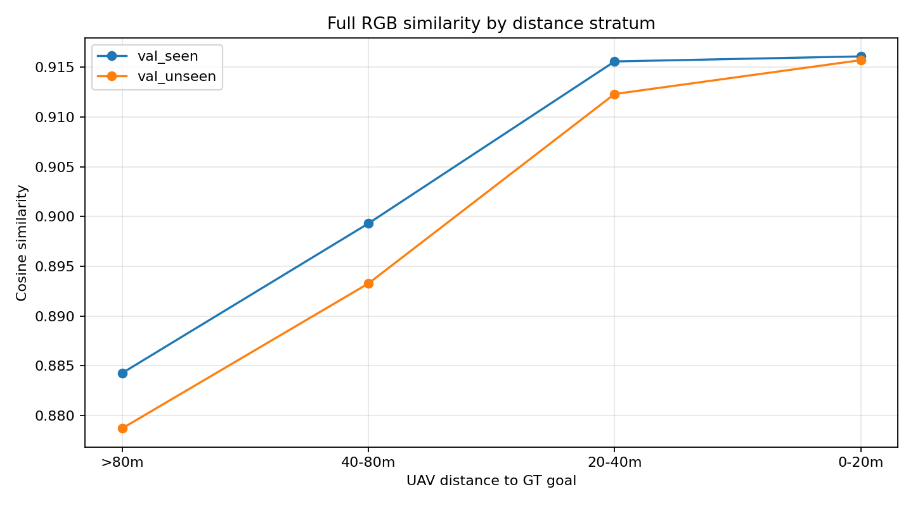

# Visual Goal Abstraction / Minimal Sufficient Visual Template

Branch: `2027-CVPR/visual-goal-abstraction` (base `a9d95e3`).

## Protocol and input audit

Goal templates are 40/80/120 m georeferenced orthographic RGB crops centered on the annotated target position. That GT coordinate is used only by this offline dataset builder. CityNav does not provide captured per-step RGB frames, so query RGB is reconstructed from the same georeferenced orthophoto using an actual pose in the human trajectory and HETT’s orthographic crop geometry; no query is target-centered. Results therefore measure matching within HETT’s orthographic observation domain, not real camera imagery. The vision encoder sees pixel tensors only; labels, map names, coordinates, and candidate identities are used after feature extraction for retrieval metrics.

The available HETT renderer uses orthographic raster crops. It does not have calibrated oblique/FPV camera geometry, so no perspective warp is presented as a real cross-view observation. This means true top-down-to-oblique/FPV robustness is unavailable in this dataset interface.

| Split | Annotation rows | unique target scenes | Goal templates | trajectory-pose orthophoto queries | invalid/ground-level poses skipped |
|---|---:|---:|---:|---:|---:|
| train_seen | 21878 | 3941 | 32706 | 80403 | 1534 |
| val_seen | 2470 | 449 | 3753 | 9105 | 165 |
| val_unseen | 2697 | 510 | 4011 | 9898 | 160 |

Partial SigLIP2 tuning updated the final two vision blocks for one epoch (3,000 train_seen scene pairs, batch 8, learning rate 1e-5); all 449 val_seen target scenes were excluded from tuning. `val_unseen` is used only for final reporting and example visualization; model/extent selection uses val_seen only. `test_unseen` was not opened. The local tuned checkpoint is `artifacts/visual_goal_abstraction/models/siglip2_partial_trainseen.pt` and is intentionally not committed.

## A. Full RGB Gate

Encoder selected using `val_seen` only: `siglip2_partial`; selected template extent: 40 m.
Gate 1: **FAIL** — val_seen same-map accuracy 0.220, margin -0.022, sign-test p=1.0000, distance ρ=-0.355; untouched val_unseen same-map accuracy 0.081, margin -0.036.

| Encoder | Selected extent (val_seen) | Split | R@1 | R@5 | R@10 | Same-map hard-negative accuracy | AUROC | positive-negative margin | distance Spearman ρ |
|---|---:|---|---:|---:|---:|---:|---:|---:|---:|
| siglip | 80m | val_seen | 0.091 | 0.225 | 0.310 | 0.161 | 0.648 | -0.031 | -0.134 |
| siglip | 80m | val_unseen | 0.046 | 0.156 | 0.237 | 0.055 | 0.695 | -0.049 | -0.223 |
| siglip2 | 80m | val_seen | 0.111 | 0.269 | 0.362 | 0.171 | 0.660 | -0.020 | -0.197 |
| siglip2 | 80m | val_unseen | 0.056 | 0.185 | 0.277 | 0.062 | 0.696 | -0.033 | -0.251 |
| siglip2_partial | 40m | val_seen | 0.136 | 0.304 | 0.408 | 0.220 | 0.725 | -0.022 | -0.355 |
| siglip2_partial | 40m | val_unseen | 0.075 | 0.228 | 0.317 | 0.081 | 0.754 | -0.036 | -0.378 |
| dinov2_small | 80m | val_seen | 0.098 | 0.250 | 0.341 | 0.172 | 0.639 | -0.055 | -0.018 |
| dinov2_small | 80m | val_unseen | 0.049 | 0.165 | 0.247 | 0.057 | 0.672 | -0.083 | -0.078 |

Selected encoder negative-pool breakdown (`siglip2_partial`, 40 m; selection on val_seen only):

| Split | Pool | n | Accuracy | AUROC | Margin |
|---|---|---:|---:|---:|---:|
| val_seen | random | 9105 | 0.889 | 0.874 | 0.080 |
| val_seen | same_map | 9101 | 0.220 | 0.335 | -0.022 |
| val_seen | nearby | 9058 | 0.241 | 0.355 | -0.019 |
| val_seen | visually_similar | 9105 | 0.136 | 0.254 | -0.030 |
| val_seen | distance adjusted for altitude + brightness + map | 9105 | — | — | partial ρ=-0.244 (p=0.000) |
| val_seen | uniform same-map random-rank baseline | 9101 | 0.049 | — | observed hard-negative accuracy=0.220 |
| val_unseen | random | 9898 | 0.852 | 0.826 | 0.056 |
| val_unseen | same_map | 9898 | 0.081 | 0.226 | -0.036 |
| val_unseen | nearby | 9898 | 0.086 | 0.237 | -0.035 |
| val_unseen | visually_similar | 9898 | 0.075 | 0.216 | -0.037 |
| val_unseen | distance adjusted for altitude + brightness + map | 9898 | — | — | partial ρ=-0.232 (p=0.000) |
| val_unseen | uniform same-map random-rank baseline | 9898 | 0.008 | — | observed hard-negative accuracy=0.081 |

Hard-negative pools are explicitly separated into random, same-map, nearby (≤200 m), and visually similar. The preregistered Gate 1 threshold is same-map accuracy ≥0.55, positive margin, paired sign test p<0.05, and a negative query-to-goal distance Spearman trend (p<0.05) on val_seen; the selected encoder/extent is then reported on untouched val_unseen. Similarity-vs-distance values are query-to-positive-template cosine, normalized per episode; distance confounds also report residual Spearman after altitude, brightness, and map fixed effects.

Interpretation: the selected partial-tuned SigLIP2 is above a uniform same-map random-rank baseline (0.049 on val_seen; 0.008 on val_unseen), so the result is not equivalent to no visual information. It also shows a strong approach trend (val_seen ρ=-0.355; adjusted ρ=-0.244 after altitude, brightness, and map fixed effects). However, its strongest same-map distractor still beats the true scene on most queries (accuracy 0.220; margin -0.022; AUROC 0.725 over the full same-map negative pool), and held-out accuracy is only 0.081. Under the preregistered reliability gate, this is insufficient for dependable place identity matching.



## B. Progressive abstraction L0–L9

Gate 1 did not pass (or abstraction was not requested); per protocol the abstraction, ablations, cross-view retrieval, Top-K reranking, and oracle stages were stopped.

### What each level removes

| Level | Texture | Color | Background | Semantic regions | Geometry/layout |
|---|---|---|---|---|---|
| L0 Full RGB | ✓ | ✓ | ✓ | implicit | ✓ |
| L1 Background Blur | local preserved | ✓ | surrounding blurred | implicit | ✓ |
| L2 Target + Anchor | retained locally | ✓ | removed outside masks | implicit | ✓ |
| L3 Low-frequency | removed | coarse | ✓ | implicit | ✓ |
| L4 Posterized | ✓ | 4/8/16-level quantized | ✓ | implicit | ✓ |
| L5 Grayscale | ✓ | removed | ✓ | implicit | ✓ |
| L6 Semantic Regions | removed | fixed palette | coarse | ✓ | ✓ |
| L7 Contour + Color | removed | coarse | removed | partial | ✓ |
| L8 Pure Contour | removed | removed | removed | removed | ✓ |
| L9 Target + Anchor Geometry | removed | removed | removed | target/anchor only | ✓ |

The full machine-readable result (including all distance bins, per-episode curves, negative pools, and confound controls) is `artifacts/visual_goal_abstraction/eval/full_goal_retrieval.json`.

## C. Minimal sufficient representation

**Not determined.** Full RGB itself failed same-map retrieval, so the protocol stopped before testing whether texture, color, target appearance, anchor appearance, geometry, or context is minimally sufficient. No abstraction level is claimed to work.

## D. Target vs anchor vs context

**Not run by the Gate 1 stop rule.** Target-only, anchor-only, target+anchor, and context contribution are not inferred from the full-RGB result. The implementation is ready to run only after a future valid full-template matching gate.

## E. Cross-view

True oblique and FPV comparisons are unavailable: CityNav supplies no captured frames and HETT has no calibrated 3D scene/camera renderer. We cannot determine whether viewpoint gap is the main bottleneck. The altitude/brightness/map-adjusted distance correlation is a confound control within the orthographic interface, not a cross-view test.

## F. Belief Top-K reranking and G. Oracle upper bound

**Not run:** Gate 1 failed, so no B0 Top-K visual rerank or oracle was evaluated. Thus there is no measured R@1 improvement and no empirical oracle upper bound from this run. The candidate reranker/exporter remains available for a future experiment if the full-template gate is first made reliable.

## Case judgement

**CASE D** — Full RGB Goal Template retrieval failed the same-map validation-seen gate. Stop visual-imagination/diffusion work under this protocol.

## Viewable examples

- [val_seen: 100 full-RGB query / goal / same-map-hard-negative panels](artifacts/visual_goal_abstraction/eval/visualizations/full_rgb_gate_examples_val_seen_n100.jpg)
- [val_unseen: 100 full-RGB query / goal / same-map-hard-negative panels](artifacts/visual_goal_abstraction/eval/visualizations/full_rgb_gate_examples_val_unseen_n100.jpg)

## Reproduction

Run from the repository root:

```bash
bash multiagent/scripts/run_visual_goal_experiment.sh
```
