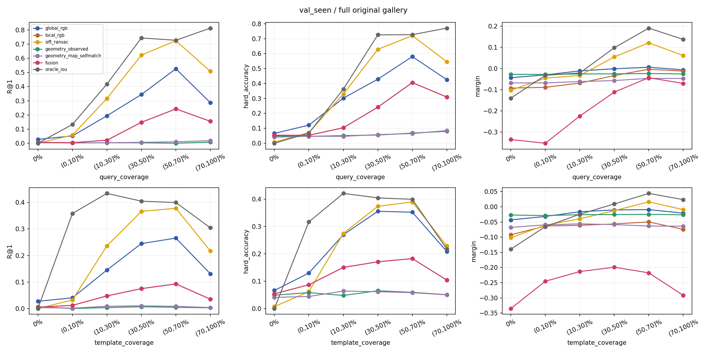
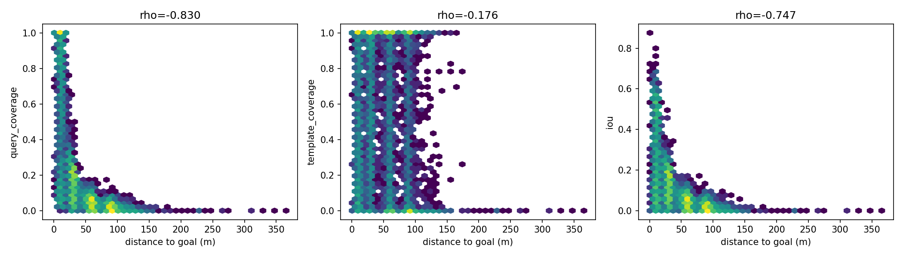
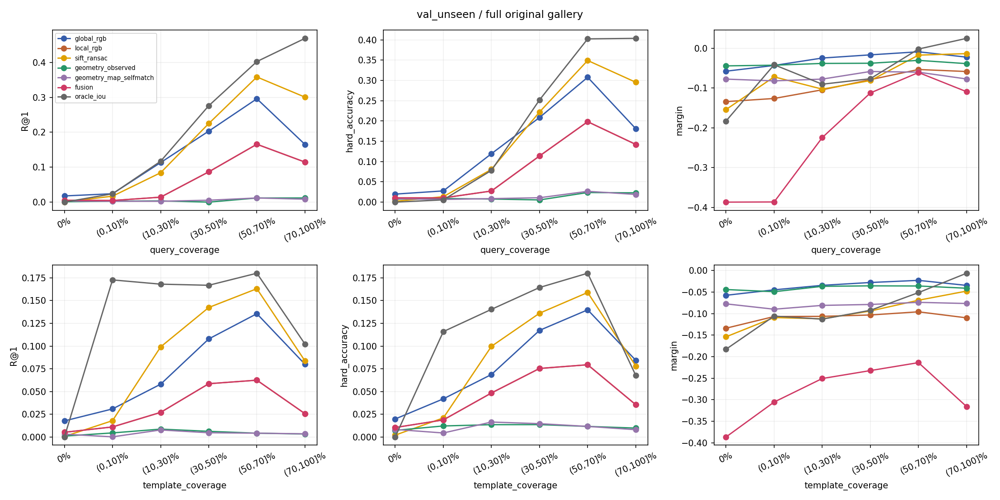
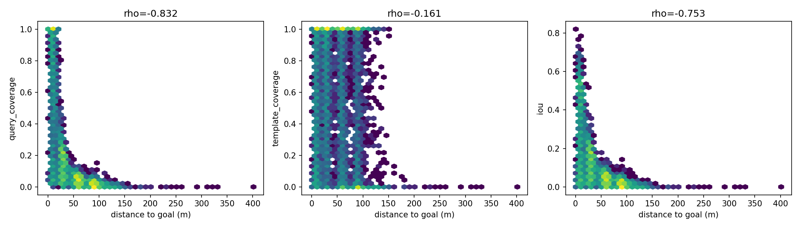
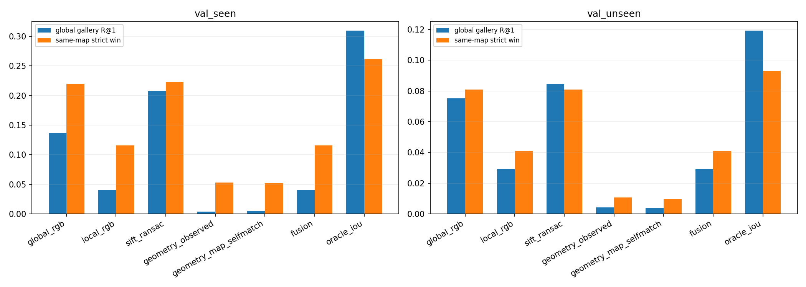

# Visual Goal Matching Failure Diagnosis

Base: `2027-CVPR/visual-goal-abstraction-gate1` @ `856e8400246730554ee63e39731761e5fdf72973`. Branch: `2027-CVPR/visual-overlap-geometry-diagnosis`.

## Scope and direct answers

**Only orthophoto observations are evaluated.** Query is a crop at the released human trajectory pose, not a captured UAV camera frame. Query and templates use the same map PNG. No new backbone training, generation, controller changes, rollout, or test_unseen access. Prior code, data, report and metrics are preserved.

1. **No common pixels account for only part of the failure.** Zero-overlap observations: 10.82% seen / 9.69% unseen. Among Global RGB R@1 failures, 10.29% unseen have zero overlap; 67.53% have either coverage ≤10%. These are descriptive counts, not causal percentages.

2. **Local methods are not interchangeable.** With both QueryCoverage and TemplateCoverage >50%, unseen Global RGB R@1 is 32.58%, SIFT + RANSAC is 44.83%. Paired episode-cluster difference: 12.25 percentage points, 95% CI [7.66, 16.46] percentage points, p=0.0002. DINO patch matching and structure-only results below remain part of the conclusion. This compares methods, not an isolated causal ablation of pooling with the same backbone.

3. **Imagined images are not justified by this experiment; geometry alone is not established either.** Successful same-source local correspondence can depend on actual texture and shared pixels. The tested contour/layout methods cannot substitute for RGB. No result here proves a generated template would retain the correspondence signal or that geometry-only belief updates would suffice.

## Dataset and unchanged protocol

| Split | Queries | Episodes | 40m scenes | Maps |
|---|---:|---:|---:|---:|
| val_seen | 9105 | 2470 | 449 | 23 |
| val_unseen | 9898 | 2697 | 510 | 4 |

All 19,003 original validation queries retained. Anchor-context duplicate templates have identical RGB paths; their max-pooled scene score is exactly reproduced by a single scene entry. Original full gallery and same-map negative pool remain unchanged. Both baseline splits numerically reproduce the prior 40m partial-tuned SigLIP2 metrics.

R@K uses all scenes in the split. Hard accuracy is a **strict** positive > maximum same-map-negative win; ties are reported separately. Recall at tied scores uses the expected rank under uniformly randomized ties, so blank/no-match methods do not gain from candidate order. The old non-tied Global RGB results are unchanged. AUROC in the tables means positives vs **all same-map negatives pooled**, not hardest-only AUROC and not the fraction of per-query wins. Those additional metrics are in JSON.

95% CI: 1,000 episode-cluster bootstrap replicates, preserving all selected poses per sampled episode. AUROC CI uses 300 episode bootstrap draws over a 1,024-bin score histogram; the reported point AUROC is exact. Paired p-values use 4,999 two-sided episode sign-flip permutations. Extra scene-cluster CIs expose dependence from shared target templates. Only four unseen maps remain a limitation on generalization. Family/variant comparisons are exploratory; no multiplicity correction is claimed.

## Coordinate and footprint audit

Pixel reconstruction audit: **54/54 sampled Query/Template JPEGs pixel-exact** after reproducing the original crop and JPEG encoding (all_exact=True). At least one query and one candidate per evaluated map. Every map PNG/TIFF shape agrees. Affines and sizes are saved in `overlap_oracle.json`.

- Each TIFF affine supplies origin and 0.1m/pixel scale; local XY is not latitude/longitude. Spatial overlap across different map IDs is zero in the oracle only.
- Exact rasterio floor-to-pixel source corners and OpenCV homography are reconstructed. At yaw=0, +world X points up and +world Y points left in the crop. Rotation is derived from saved yaw and trajectory pose, not goal distance.
- Valid footprint is the transformed crop clipped to the hull of source pixel centres. Out-of-raster padding is excluded. Bilinear fractional support at the boundary leaves at most a half-source-pixel conservative border; floor quantization is explicitly reproduced.
- TIFF is elevation with nodata; that mask is not treated as RGB validity. PNG has no alpha. Unlabelled internal RGB voids cannot be reliably inferred; exact internal visibility/occlusion from 3D is unavailable.
- The old template semantic-mask helper swaps row/column compared with actual RGB. It is not used here and is not overwritten. New map geometry uses the audited RGB homography.

IoU = intersection / union; QueryCoverage = intersection / valid Query area; TemplateCoverage = intersection / valid Template area. Shared area in m² is saved per query; polygon slivers below 1e-6 m² count as zero consistently in every bin. Footprint metadata never enters an RGB/observed-geometry score function.

## Overlap distribution

### val_seen

| Coverage bin | QueryCoverage n | TemplateCoverage n | IoU n |
|---|---:|---:|---:|
| 0% | 985 | 985 | 985 |
| (0,10]% | 4316 | 840 | 4771 |
| (10,30]% | 2013 | 1046 | 2365 |
| (30,50]% | 311 | 878 | 606 |
| (50,70]% | 293 | 828 | 373 |
| (70,100]% | 1187 | 4528 | 5 |

Distance correlation with QueryCoverage / TemplateCoverage / IoU: -0.830 / -0.176 / -0.747. Distance is associated with visibility, but cannot replace any of the three overlap measurements.

| Group (both coverage >50%; low means either ≤10%) | n | Global RGB R@1 | Hard acc |
|---|---:|---:|---:|
| Zero overlap | 985 | 2.74% | 6.61% |
| Low either | 5673 | 4.71% | 11.53% |
| High both | 521 | 54.13% | 61.80% |





### val_unseen

| Coverage bin | QueryCoverage n | TemplateCoverage n | IoU n |
|---|---:|---:|---:|
| 0% | 959 | 959 | 959 |
| (0,10]% | 4997 | 906 | 5461 |
| (10,30]% | 1969 | 1033 | 2318 |
| (30,50]% | 369 | 955 | 714 |
| (50,70]% | 338 | 944 | 437 |
| (70,100]% | 1266 | 5101 | 9 |

Distance correlation with QueryCoverage / TemplateCoverage / IoU: -0.832 / -0.161 / -0.753. Distance is associated with visibility, but cannot replace any of the three overlap measurements.

| Group (both coverage >50%; low means either ≤10%) | n | Global RGB R@1 | Hard acc |
|---|---:|---:|---:|
| Zero overlap | 959 | 1.77% | 1.98% |
| Low either | 6341 | 2.51% | 2.96% |
| High both | 617 | 32.58% | 33.06% |





Every coverage bin contains n, R@1/5/10, hard accuracy, margin, AUROC and mean goal distance in `failure_analysis.json`, for all primary methods including SIFT. High overlap means both coverage ratios >50%; it is an analysis stratum, never a model input or learned threshold.

## A: Overlap ranking oracle

**This is privileged spatial ranking, not deployable navigation, and not a mathematical upper bound on all possible visual classifiers.** Other candidates can share more visible pixels than the annotated goal. Three rankings keep the exact same full candidate pool; zero-overlap cross-map candidates tie at zero. Expected tied Recall and strict hard wins intentionally differ.

### val_seen

| Method | R@1 | R@5 | R@10 | Same-map hard acc | Margin | AUROC |
|---|---:|---:|---:|---:|---:|---:|
| query_coverage | 30.84% | 67.64% | 80.33% | 25.77% | 0.0314 | 0.8490 |
| template_coverage | 31.76% | 67.95% | 80.58% | 25.77% | -0.1213 | 0.7958 |
| iou | 30.97% | 67.65% | 80.35% | 26.10% | -0.0073 | 0.8437 |

### val_unseen

| Method | R@1 | R@5 | R@10 | Same-map hard acc | Margin | AUROC |
|---|---:|---:|---:|---:|---:|---:|
| query_coverage | 11.92% | 34.13% | 48.10% | 8.97% | -0.0563 | 0.8636 |
| template_coverage | 12.37% | 35.15% | 48.94% | 9.34% | -0.2345 | 0.8143 |
| iou | 11.93% | 34.29% | 48.23% | 9.32% | -0.0562 | 0.8597 |

## B: Methods

- **Global RGB:** unchanged partial-tuned SigLIP2 checkpoint, 40m goal; cosine similarity. No retraining or retuning.
- **DINO NN/MNN:** frozen DINOv2-small patch tokens. Standard 256 resize / central 224 processor crop is accounted for in valid masks. Native 16×16 tokens are spatially pooled in 2×2 cells to an 8×8 local grid. No whole-image pooling.
- **DINO spatial:** MNN cosine >0.6; least-squares 2D similarity fit; residual threshold 0.15 in normalized image coordinates. Support and consistency weight the local appearance score. This can penalize useful partial matches; it is not assumed optimal.
- **DINO RANSAC:** every query–candidate pair, ≥4 mutual matches, 0.1 normalized reprojection threshold, 1,000 iterations. Low-match/fit failure is explicit, not silently removed. A separate 200-query positive/hard-negative audit is retained.
- **SIFT RANSAC:** up to 128 keypoints/image, standard SIFT defaults, 0.75 ratio test, similarity-transform RANSAC with 3/224 reprojection threshold. ≥4 inliers required; score = inliers / sqrt(query keypoints × template keypoints). No map, position, scale or yaw provided to the matcher; no candidate shortlist.
- **Observed geometry (B2a):** blurred grayscale Canny boundaries; semantic building/road/landmark segmentation is **unavailable** from RGB alone. These are unlabeled observed contours, with padding-boundary edges excluded.
- **Map geometry (B2b):** all mapped building/road/parking/named-object boundaries rasterized from the same object database on both sides. No privileged target/anchor labels. This is explicitly **map self-matching**, uses known rendering poses offline, and is not independent visual evidence.
- **Chamfer/DT:** symmetric truncated distance-transform matching on 32×32 edge maps. Image-only bank: rotations 0/90/180/270°, scales .5/1/2, translations -8/0/8 pixels. It is a coarse baseline, not arbitrary homography registration. Contour IoU and 4×4 occupancy-layout cosine use the same bank as separate fixed controls. Weak contours, finite rotations, and grouping quality limit negative conclusions.

### Fusion calibration

DINO spatial + observed Chamfer uses within-query percentile-normalized scores and alpha in [0,.25,.5,.75,1]. Selected on val_seen hard accuracy: **alpha=1.0**. SIFT + observed Chamfer independently selects **alpha=1.0** on val_seen. Every fixed alpha is reported below on both splits; val_unseen does not choose either weight. Percentile normalization preserves each query ranking but changes pooled score distributions; margins across methods have different units and must not be directly compared as effect sizes.

### val_seen: full original pool

| Method | R@1 | R@5 | R@10 | Same-map hard acc | Margin | AUROC |
|---|---:|---:|---:|---:|---:|---:|
| Global SigLIP2 | 13.64% | 30.44% | 40.83% | 22.01% | -0.0218 | 0.7249 |
| Local DINO NN | 9.42% | 19.41% | 25.41% | 16.98% | -0.0491 | 0.6307 |
| Local DINO MNN | 6.37% | 14.79% | 20.84% | 15.46% | -0.0740 | 0.6302 |
| Local DINO spatial | 4.04% | 9.24% | 13.30% | 11.58% | -0.0698 | 0.6092 |
| Local DINO RANSAC | 5.89% | 13.22% | 18.55% | 14.33% | -0.0505 | 0.6297 |
| Local SIFT RANSAC | 20.78% | 39.27% | 43.48% | 22.32% | -0.0257 | 0.6926 |
| Geometry observed Chamfer | 0.39% | 1.74% | 2.98% | 5.30% | -0.0265 | 0.5020 |
| Geometry map self-match Chamfer | 0.52% | 1.89% | 3.09% | 5.20% | -0.0624 | 0.5359 |
| DINO + geometry | 4.04% | 9.24% | 13.30% | 11.58% | -0.2672 | 0.6157 |
| SIFT + geometry | 20.78% | 39.27% | 43.48% | 22.32% | -0.1800 | 0.7257 |
| observed_contour_iou | 0.46% | 1.66% | 3.37% | 5.55% | -0.0730 | 0.5127 |
| observed_structural_layout | 0.40% | 1.49% | 2.89% | 5.29% | -0.0409 | 0.5051 |
| map_contour_iou | 0.46% | 1.89% | 3.30% | 5.43% | -0.0778 | 0.5330 |
| map_structural_layout | 0.42% | 1.77% | 3.40% | 5.54% | -0.0824 | 0.5427 |

| Method | R@1 episode 95% CI | Hard acc episode 95% CI |
|---|---|---|
| Global SigLIP2 | [0.12868365714607474, 0.14421097052148427] | [0.20924473818103176, 0.23072786054186442] |
| Local DINO NN | [0.08815705288984717, 0.10042889976861166] | [0.16091944488936685, 0.17880367890024057] |
| Local DINO MNN | [0.058663869925321736, 0.06865687079103668] | [0.1466927588180955, 0.1621206520842789] |
| Local DINO spatial | [0.036711874112403425, 0.04457388922760256] | [0.10881242414493356, 0.12291514391993416] |
| Local DINO RANSAC | [0.05445530452427772, 0.06370713123359761] | [0.13583312399105782, 0.15112359039997905] |
| Local SIFT RANSAC | [0.19955105943957985, 0.21604731699179122] | [0.21442697455504953, 0.232576201205125] |
| Geometry observed Chamfer | [0.002533105088703237, 0.005409343709680345] | [0.04726530355357481, 0.059174220864754636] |
| Geometry map self-match Chamfer | [0.0036680770740807485, 0.006754132577561575] | [0.04649055807775218, 0.05799016061372634] |
| DINO + geometry | [0.036711874112403425, 0.04457388922760256] | [0.10881242414493356, 0.12291514391993416] |
| SIFT + geometry | [0.19955105943957985, 0.21604731699179122] | [0.21442697455504953, 0.232576201205125] |

| Fixed alpha | DINO fusion R@1 | DINO hard acc | SIFT fusion R@1 | SIFT hard acc |
|---|---:|---:|---:|---:|
| 0.0 | 0.39% | 5.30% | 0.39% | 5.30% |
| 0.25 | 0.91% | 6.34% | 5.36% | 10.84% |
| 0.5 | 1.24% | 7.68% | 7.85% | 16.10% |
| 0.75 | 1.55% | 9.35% | 8.99% | 18.90% |
| 1.0 | 4.04% | 11.58% | 20.78% | 22.32% |

### val_seen: high-both-overlap subset

| Method | R@1 | R@5 | R@10 | Same-map hard acc | Margin | AUROC |
|---|---:|---:|---:|---:|---:|---:|
| global_rgb | 54.13% | 84.26% | 90.79% | 61.80% | 0.0090 | 0.8955 |
| local_rgb | 29.37% | 47.41% | 56.24% | 45.87% | 0.0124 | 0.8679 |
| sift_ransac | 77.83% | 99.58% | 99.81% | 77.54% | 0.1476 | 0.9852 |
| geometry_observed | 0.38% | 2.30% | 3.65% | 7.87% | -0.0223 | 0.5307 |
| geometry_map_selfmatch | 1.92% | 5.77% | 8.47% | 9.60% | -0.0455 | 0.6011 |
| fusion | 29.37% | 47.41% | 56.24% | 45.87% | -0.0308 | 0.8821 |
| oracle_iou | 78.69% | 100.00% | 100.00% | 78.69% | 0.2394 | 0.9909 |
| dino_ransac | 46.26% | 74.66% | 84.84% | 62.57% | 0.0362 | 0.9345 |
| sift_fusion | 77.83% | 99.58% | 99.81% | 77.54% | 0.0796 | 0.9917 |

| Local control vs Global RGB | R@1 difference | Episode 95% CI | paired p |
|---|---:|---|---:|
| dino_ransac | -7.87% | [-0.1305662188099808, -0.023032629558541268] | 0.0062 |
| sift_ransac | 23.70% | [0.18231765834932823, 0.2869481765834933] | 0.0002 |
| observed_contour_iou | -52.40% | [-0.5662667946257197, -0.4760076775431862] | 0.0002 |
| observed_structural_layout | -52.78% | [-0.5758157389635317, -0.4798464491362764] | 0.0002 |
### val_unseen: full original pool

| Method | R@1 | R@5 | R@10 | Same-map hard acc | Margin | AUROC |
|---|---:|---:|---:|---:|---:|---:|
| Global SigLIP2 | 7.52% | 22.81% | 31.71% | 8.10% | -0.0360 | 0.7540 |
| Local DINO NN | 5.92% | 16.31% | 22.52% | 6.79% | -0.0763 | 0.6632 |
| Local DINO MNN | 4.37% | 13.11% | 18.50% | 5.81% | -0.1105 | 0.6489 |
| Local DINO spatial | 2.92% | 8.43% | 12.07% | 4.09% | -0.1096 | 0.6287 |
| Local DINO RANSAC | 4.05% | 11.75% | 16.93% | 5.69% | -0.0810 | 0.6476 |
| Local SIFT RANSAC | 8.45% | 24.96% | 34.65% | 8.10% | -0.0769 | 0.6965 |
| Geometry observed Chamfer | 0.42% | 1.44% | 2.72% | 1.07% | -0.0407 | 0.5169 |
| Geometry map self-match Chamfer | 0.38% | 1.47% | 2.81% | 0.96% | -0.0783 | 0.5055 |
| DINO + geometry | 2.92% | 8.43% | 12.07% | 4.09% | -0.2973 | 0.6439 |
| SIFT + geometry | 8.45% | 24.96% | 34.65% | 8.10% | -0.2517 | 0.7326 |
| observed_contour_iou | 0.41% | 1.34% | 2.52% | 1.10% | -0.1032 | 0.5147 |
| observed_structural_layout | 0.35% | 1.52% | 2.74% | 1.05% | -0.0597 | 0.5238 |
| map_contour_iou | 0.44% | 1.42% | 2.43% | 1.02% | -0.0961 | 0.5035 |
| map_structural_layout | 0.35% | 1.42% | 2.72% | 0.89% | -0.1006 | 0.5217 |

| Method | R@1 episode 95% CI | Hard acc episode 95% CI |
|---|---|---|
| Global SigLIP2 | [0.07005410638977305, 0.08098024333771713] | [0.07576649120031277, 0.08704518211279484] |
| Local DINO NN | [0.054276582739810515, 0.06441175675383827] | [0.06255572125682887, 0.07338424107438792] |
| Local DINO MNN | [0.039517027205146944, 0.04771687219045988] | [0.053268691574462866, 0.06307138807544196] |
| Local DINO spatial | [0.02593698765060448, 0.03238974938163892] | [0.037219444397467265, 0.04508144046340858] |
| Local DINO RANSAC | [0.0365288253584618, 0.04443014616835424] | [0.051798806542039215, 0.06172737205684622] |
| Local SIFT RANSAC | [0.07915788364011267, 0.09009626881799192] | [0.07560839948288536, 0.08700015020620558] |
| Geometry observed Chamfer | [0.0029463247867071466, 0.005362147963374753] | [0.008597973921311364, 0.012914064007737225] |
| Geometry map self-match Chamfer | [0.0025540899499417106, 0.0052011011957752195] | [0.007472332294225637, 0.011679579662178375] |
| DINO + geometry | [0.02593698765060448, 0.03238974938163892] | [0.037219444397467265, 0.04508144046340858] |
| SIFT + geometry | [0.07915788364011267, 0.09009626881799192] | [0.07560839948288536, 0.08700015020620558] |

| Fixed alpha | DINO fusion R@1 | DINO hard acc | SIFT fusion R@1 | SIFT hard acc |
|---|---:|---:|---:|---:|
| 0.0 | 0.42% | 1.07% | 0.42% | 1.07% |
| 0.25 | 0.87% | 1.70% | 2.49% | 3.49% |
| 0.5 | 1.15% | 2.11% | 3.27% | 4.31% |
| 0.75 | 1.34% | 2.30% | 4.03% | 5.16% |
| 1.0 | 2.92% | 4.09% | 8.45% | 8.10% |

### val_unseen: high-both-overlap subset

| Method | R@1 | R@5 | R@10 | Same-map hard acc | Margin | AUROC |
|---|---:|---:|---:|---:|---:|---:|
| global_rgb | 32.58% | 74.23% | 83.63% | 33.06% | -0.0076 | 0.9616 |
| local_rgb | 19.94% | 44.57% | 55.75% | 23.01% | -0.0451 | 0.9086 |
| sift_ransac | 44.83% | 91.44% | 97.63% | 44.08% | 0.0061 | 0.9835 |
| geometry_observed | 1.13% | 2.92% | 5.03% | 2.27% | -0.0302 | 0.5436 |
| geometry_map_selfmatch | 1.30% | 3.58% | 6.03% | 2.92% | -0.0575 | 0.5696 |
| fusion | 19.94% | 44.57% | 55.75% | 23.01% | -0.0478 | 0.9217 |
| oracle_iou | 49.11% | 94.49% | 98.54% | 49.11% | 0.0390 | 0.9915 |
| dino_ransac | 31.93% | 69.37% | 83.63% | 36.95% | -0.0176 | 0.9581 |
| sift_fusion | 44.83% | 91.44% | 97.63% | 44.08% | 0.0048 | 0.9907 |

| Local control vs Global RGB | R@1 difference | Episode 95% CI | paired p |
|---|---:|---|---:|
| dino_ransac | -0.65% | [-0.0502836304700162, 0.040584415584415584] | 0.8316 |
| sift_ransac | 12.25% | [0.07655281427069133, 0.16464738472927112] | 0.0002 |
| observed_contour_iou | -31.60% | [-0.35495132294851045, -0.2778642814153125] | 0.0002 |
| observed_structural_layout | -31.60% | [-0.3548381608433618, -0.27668785388271094] | 0.0002 |



## Coverage, failures and fair-subset comparisons

Missing feature support remains a zero-score abstention in the primary full-gallery result; no query or candidate is quietly removed. Fractional tied Recall can therefore be nonzero without a successful correspondence. Status definitions and all-pair/positive counts are saved in `correspondence_controls.json`.

### val_seen

Original feature availability: `{"local": {"queries": 9104, "candidates": 449, "total_queries": 9105, "total_candidates": 449, "positive_insufficient_or_degenerate_fit_rate": 0.09928610653487095, "all_pair_insufficient_or_degenerate_fit_rate": 0.24453389006505397}, "observed": {"queries": 9060, "candidates": 449, "total_queries": 9105, "total_candidates": 449}, "map": {"queries": 8893, "candidates": 445, "total_queries": 9105, "total_candidates": 449}}`.

Strict common-valid-query subset with every same-map candidate usable: n=6997. An empty subset is unavailable, not evidence of equal performance.

Supplementary common-feature gallery: 8836 queries / 445 candidates. All methods use this identical intersection gallery; it differs from the primary original gallery and is labeled separately.

| Method | R@1 | R@5 | R@10 | Same-map hard acc | Margin | AUROC |
|---|---:|---:|---:|---:|---:|---:|
| global_rgb | 13.71% | 30.67% | 41.10% | 22.02% | -0.0219 | 0.7309 |
| local_rgb | 4.03% | 9.03% | 13.06% | 11.58% | -0.0705 | 0.6103 |
| sift_ransac | 21.01% | 39.72% | 43.95% | 22.53% | -0.0258 | 0.6944 |
| geometry_observed | 0.40% | 1.77% | 3.00% | 5.38% | -0.0262 | 0.5006 |
| geometry_map_selfmatch | 0.53% | 1.92% | 3.13% | 5.34% | -0.0600 | 0.5335 |
| sift_fusion | 21.01% | 39.72% | 43.95% | 22.53% | -0.1825 | 0.7246 |

SIFT/RANSAC failure status counts: `{"dino_ransac": {"positive_status_counts": {"0": 8227, "1": 878, "2": 0, "3": 0}, "all_pair_status_counts": {"0": 3090383, "1": 997762, "2": 0, "3": 0}}, "sift_ransac": {"positive_status_counts": {"0": 4383, "1": 39, "2": 3683, "3": 1000}, "all_pair_status_counts": {"0": 168666, "1": 17511, "2": 3522049, "3": 379919}}, "status_definitions": {"dino": ["ok", "insufficient mutual matches", "ransac_failed", "reserved"], "sift": ["ok", "insufficient keypoints", "insufficient ratio-test matches", "ransac_failed_or_less_than_4_inliers"]}}`

### val_unseen

Original feature availability: `{"local": {"queries": 9898, "candidates": 510, "total_queries": 9898, "total_candidates": 510, "positive_insufficient_or_degenerate_fit_rate": 0.08395635481915538, "all_pair_insufficient_or_degenerate_fit_rate": 0.23470893307818178}, "observed": {"queries": 9827, "candidates": 508, "total_queries": 9898, "total_candidates": 510}, "map": {"queries": 9734, "candidates": 494, "total_queries": 9898, "total_candidates": 510}}`.

Strict common-valid-query subset with every same-map candidate usable: n=0. An empty subset is unavailable, not evidence of equal performance.

Supplementary common-feature gallery: 9540 queries / 494 candidates. All methods use this identical intersection gallery; it differs from the primary original gallery and is labeled separately.

| Method | R@1 | R@5 | R@10 | Same-map hard acc | Margin | AUROC |
|---|---:|---:|---:|---:|---:|---:|
| global_rgb | 7.34% | 22.83% | 31.87% | 7.84% | -0.0356 | 0.7548 |
| local_rgb | 2.72% | 8.18% | 11.74% | 3.86% | -0.1097 | 0.6246 |
| sift_ransac | 8.56% | 25.55% | 35.56% | 8.18% | -0.0782 | 0.7009 |
| geometry_observed | 0.40% | 1.45% | 2.76% | 1.11% | -0.0353 | 0.5146 |
| geometry_map_selfmatch | 0.39% | 1.51% | 2.88% | 1.00% | -0.0649 | 0.5015 |
| sift_fusion | 8.56% | 25.55% | 35.56% | 8.18% | -0.2517 | 0.7345 |

SIFT/RANSAC failure status counts: `{"dino_ransac": {"positive_status_counts": {"0": 9089, "1": 809, "2": 0, "3": 0}, "all_pair_status_counts": {"0": 3866929, "1": 1181051, "2": 0, "3": 0}}, "sift_ransac": {"positive_status_counts": {"0": 4752, "1": 91, "2": 3945, "3": 1110}, "all_pair_status_counts": {"0": 250430, "1": 49260, "2": 4312591, "3": 435699}}, "status_definitions": {"dino": ["ok", "insufficient mutual matches", "ransac_failed", "reserved"], "sift": ["ok", "insufficient keypoints", "insufficient ratio-test matches", "ransac_failed_or_less_than_4_inliers"]}}`

## Hard negatives and nuisance controls

The hardest negative is selected separately by each method within the unchanged same-map pool; global-model hardest negatives also supply fixed visualization panels. These are diagnostic choices after scoring, never encoder inputs.

### val_seen

High-both-overlap queries: n=521. Global hardest negatives themselves cover >50% of Query in 28.60% of cases and >50% of their own template in 31.67%. Negative IoU ≥ positive IoU in 13.82%. Positive–negative target centres average 84.8m apart; their Global RGB feature cosine averages 0.939.

Balanced same-map 20-candidate Global RGB control: n=6431, R@1=25.19%, CI=[0.23935483018950238, 0.2636193799062701]. Seen maps with fewer than 20 candidates are excluded in this supplemental control; it is not an exact population-standardized generalization estimate.

| Method | R@1 | R@5 | R@10 | Same-map hard acc | Margin | AUROC |
|---|---:|---:|---:|---:|---:|---:|
| padding_fraction_only | 0.30% | 1.43% | 2.81% | 2.91% | -0.0885 | 0.5087 |
| brightness_only | 0.57% | 2.22% | 4.13% | 6.78% | -0.0691 | 0.5290 |

Padding-free supplemental gallery (every retained image ≥95% valid): 4873 queries / 356 candidates.

| Method | R@1 | R@5 | R@10 | Same-map hard acc | Margin | AUROC |
|---|---:|---:|---:|---:|---:|---:|
| global_rgb | 17.26% | 38.46% | 50.79% | 25.99% | -0.0185 | 0.7483 |
| sift_ransac | 25.56% | 47.15% | 52.01% | 26.44% | -0.0229 | 0.7251 |
| geometry_observed | 0.54% | 2.23% | 3.53% | 5.33% | -0.0236 | 0.5042 |
| geometry_map_selfmatch | 0.69% | 2.49% | 3.93% | 5.84% | -0.0573 | 0.5286 |

### val_unseen

High-both-overlap queries: n=617. Global hardest negatives themselves cover >50% of Query in 59.00% of cases and >50% of their own template in 57.21%. Negative IoU ≥ positive IoU in 28.04%. Positive–negative target centres average 36.4m apart; their Global RGB feature cosine averages 0.955.

Balanced same-map 20-candidate Global RGB control: n=9898, R@1=26.70%, CI=[0.2564490124949617, 0.2774745399441844]. Seen maps with fewer than 20 candidates are excluded in this supplemental control; it is not an exact population-standardized generalization estimate.

| Method | R@1 | R@5 | R@10 | Same-map hard acc | Margin | AUROC |
|---|---:|---:|---:|---:|---:|---:|
| padding_fraction_only | 0.28% | 1.29% | 2.72% | 0.50% | -0.0831 | 0.5342 |
| brightness_only | 0.48% | 2.08% | 3.89% | 1.46% | -0.0817 | 0.5792 |

Padding-free supplemental gallery (every retained image ≥95% valid): 6103 queries / 414 candidates.

| Method | R@1 | R@5 | R@10 | Same-map hard acc | Margin | AUROC |
|---|---:|---:|---:|---:|---:|---:|
| global_rgb | 8.44% | 25.33% | 35.38% | 9.13% | -0.0338 | 0.7605 |
| sift_ransac | 9.73% | 28.45% | 39.70% | 9.24% | -0.0825 | 0.7188 |
| geometry_observed | 0.56% | 1.88% | 3.58% | 1.26% | -0.0358 | 0.5102 |
| geometry_map_selfmatch | 0.32% | 1.39% | 2.79% | 0.98% | -0.0771 | 0.4967 |

- **Shared pixels:** 100% of same-map image pairs originate from the same orthophoto; ~90% of positive pairs geometrically intersect. Successful SIFT matches can be literal shared-texture registration. This shortcut is present, not eliminated by this experiment.
- **Absolute coordinates:** present only in offline footprint/map-rendering adapters and labels, never passed to global/local RGB, contour scoring or fusion. B2b requires known pose/map structure and cannot be marketed as deployable vision under unknown pose.
- **Altitude and scale:** query side length is twice altitude AGL, whereas goals are fixed 40m. The distance/coverage plots and high-both strata expose this confound but cannot identify its independent causal effect. Pitch is metadata only; the original orthophoto renderer ignores pitch.
- **Brightness/padding/map ID:** nuisance-only baselines above, valid-pixel controls and same-map evaluation constrain these explanations. They do not prove absence of learned pixel shortcuts. Map IDs are never classifier inputs; same-map restriction removes trivial cross-map discrimination from the main hard-negative metric.
- **Split isolation:** original scene/annotation split audit has zero intersections; checkpoint training used train_seen. This run freezes that checkpoint. val_seen is development for alpha, val_unseen is held out; test_unseen files are not read. Shared appearance across scene-disjoint seen maps and repeated episodes per scene remain limitations.

## Failure figures

Blue footprint = Query, green = positive, red = global-model hardest negative; footprint insets are offline oracle data. Panels show instruction, RGBs, overlap ratios, shared m², global/local/geometry scores and goal distance. All six requested categories are retained, four deterministic examples per nonempty category per split, rather than selecting only favorable cases.

- [val_seen: no_overlap_failure, population n=920](artifacts/visual_overlap_geometry_diagnosis/figure4_val_seen_no_overlap_failure.jpg)
- [val_seen: high_overlap_global_failure, population n=199](artifacts/visual_overlap_geometry_diagnosis/figure4_val_seen_high_overlap_global_failure.jpg)
- [val_seen: rgb_fail_geometry_success, population n=307](artifacts/visual_overlap_geometry_diagnosis/figure4_val_seen_rgb_fail_geometry_success.jpg)
- [val_seen: geometry_fail_rgb_success, population n=1828](artifacts/visual_overlap_geometry_diagnosis/figure4_val_seen_geometry_fail_rgb_success.jpg)
- [val_seen: both_fail, population n=6795](artifacts/visual_overlap_geometry_diagnosis/figure4_val_seen_both_fail.jpg)
- [val_seen: similar_hard_negative, population n=1492](artifacts/visual_overlap_geometry_diagnosis/figure4_val_seen_similar_hard_negative.jpg)
- [val_unseen: no_overlap_failure, population n=940](artifacts/visual_overlap_geometry_diagnosis/figure4_val_unseen_no_overlap_failure.jpg)
- [val_unseen: high_overlap_global_failure, population n=413](artifacts/visual_overlap_geometry_diagnosis/figure4_val_unseen_high_overlap_global_failure.jpg)
- [val_unseen: rgb_fail_geometry_success, population n=93](artifacts/visual_overlap_geometry_diagnosis/figure4_val_unseen_rgb_fail_geometry_success.jpg)
- [val_unseen: geometry_fail_rgb_success, population n=789](artifacts/visual_overlap_geometry_diagnosis/figure4_val_unseen_geometry_fail_rgb_success.jpg)
- [val_unseen: both_fail, population n=9003](artifacts/visual_overlap_geometry_diagnosis/figure4_val_unseen_both_fail.jpg)
- [val_unseen: similar_hard_negative, population n=1571](artifacts/visual_overlap_geometry_diagnosis/figure4_val_unseen_similar_hard_negative.jpg)

## Decision

**Mixed CASE A + CASE B**, with substantial same-map candidate ambiguity and shared-pixel qualification.

CASE A is supported by the predominance of low effective coverage and the large high-overlap gain; completely invisible positives alone explain only a minority of failures. CASE B is supported specifically by classical local correspondence when both images share substantial content, not by all DINO patch variants. Pooling is not isolated from descriptor/training differences. CASE C is not supported by the tested structure-only methods, including the explicitly privileged map self-match. CASE D is not supported: both fusion controls select alpha=1, so geometry adds no gain. The unseen full-pool SIFT strict hard-negative accuracy equals Global RGB (8.10%), despite its high-overlap benefit. CASE E is too broad: measurable high-overlap RGB/local signal exists.

**Next step (one):** validate visibility-aware local correspondence on independently acquired observations of the same places, removing shared-orthophoto pixels before considering a belief update or visual imagination. No imagined-image generator is warranted yet.

## Reproduction and artifacts

Run from repo root:

```bash
bash multiagent/scripts/run_visual_matching_diagnosis.sh
```

Large features/score matrices and source data stay local under `artifacts/visual_overlap_geometry_diagnosis/cache/`; their SHA256 checksums are exported in `reproducibility_manifest.json`. Small metrics, per-query records, figures and scripts are committed. This avoids repeating encoder work when rerunning analyses. Requires the original local dataset, partial checkpoint and pinned cached encoders; no model download or test split is implicit.

Tests: `{"status": "PASS", "passed": 37, "seconds": 12.56, "command": "python -m pytest -q", "original_21_tests_preserved": true}`. All original 21 tests retained.

Artifacts: `overlap_oracle.json`, `coordinate_pixel_audit.json`, `baseline_overlap.json`, `geometry_vs_rgb.json`, `failure_analysis.json`, `correspondence_controls.json`, `query_diagnostics_*.jsonl`, `query_metric_records_*.npz`, `ransac_audit_*.json`, figures, tests and reproducibility manifest.
